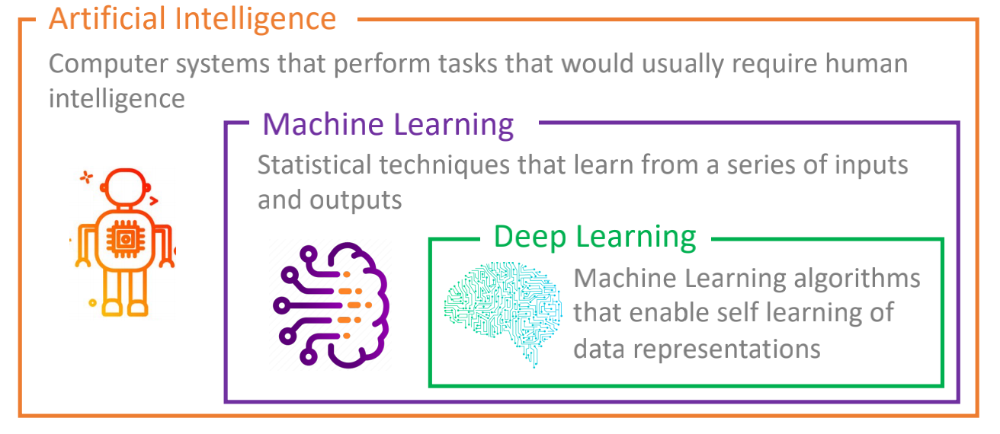
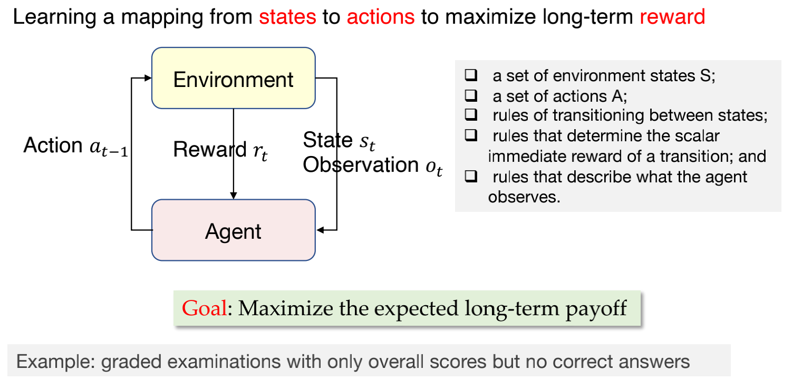
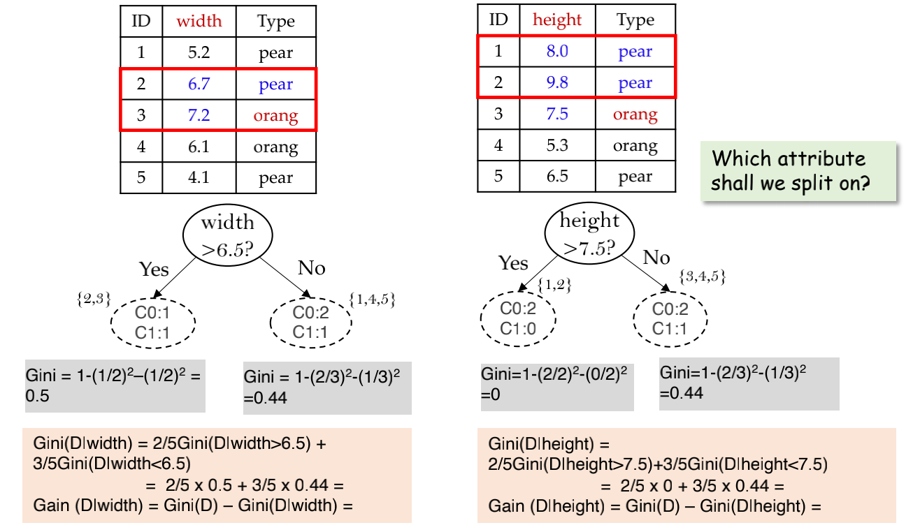
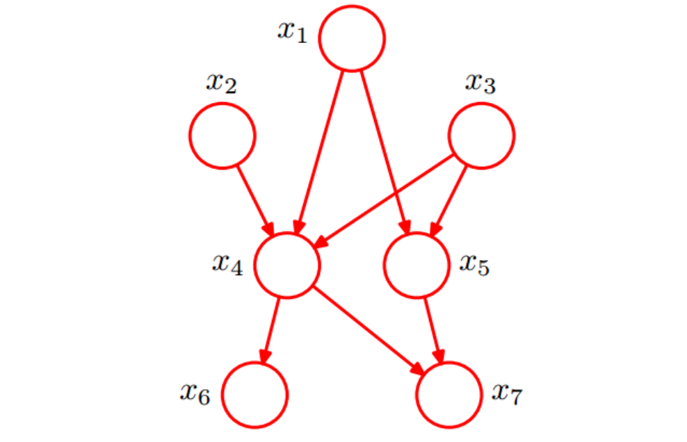
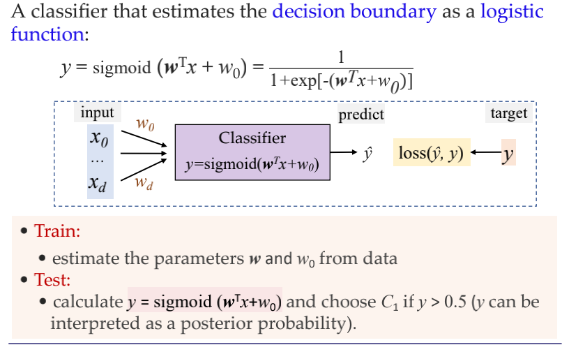
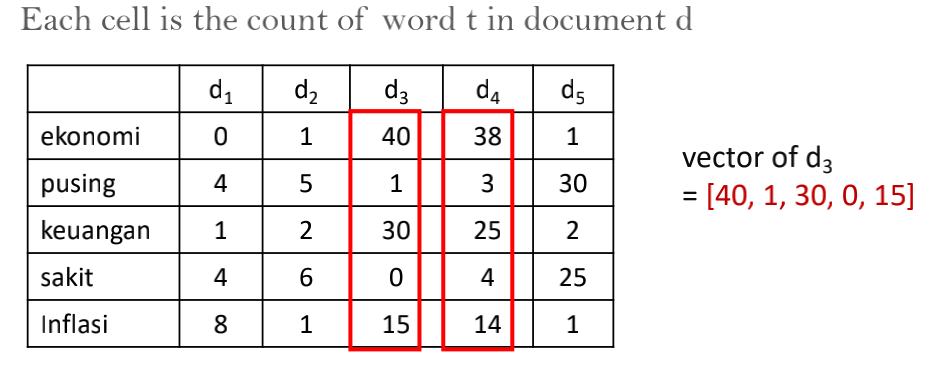
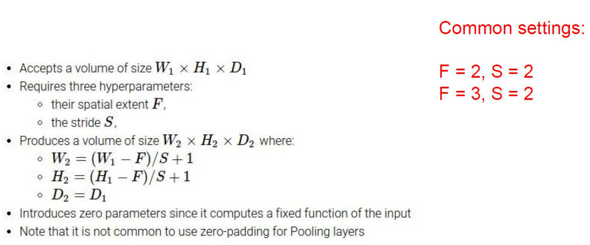

# 机器学习课程笔记

## 写在前面

这是上海交通大学软件学院 **机器学习** 课程的课程笔记，也是我在考试周三天内通过参考老师的 PPT 和网上浩如烟海的资料独自整理出来的。现在开源出来，希望学弟学妹能够进行一些参考。

[期末复习整理 MarkDown 版本](./README/md)

[期末复习整理 PDF 版本](./machine-learning.pdf)

这门课程更偏向于介绍性的课程，对开拓我们的视野起到了一定的帮助。在期末的大作业方面，主要参考了 [AI-Poet](https://github.com/WilliamX1/AI-poet) 这个项目。

非常感谢 **顾晓东** 老师，**丁玥** 老师的精彩授课，这也是我机器学习的启蒙课程。

## 目录

- [导论](#导论)
	- [分类](#分类)
	- [数据集划分](#数据集划分)
	- [过拟合和欠拟合](#过拟合和欠拟合)
	- [梯度爆炸和梯度消失](#梯度爆炸和梯度消失)
	- [系统设计例题](#系统设计例题)
- [线性回归](#线性回归-Linear-Regression)
	- [代价函数](#代价函数-Cost-Function)
	- [梯度下降法](#全量梯度下降法-batch-gradient-descent-bgd)
		- [样例](#样例) 
- [决策树](#决策树)
	- [训练方法](#训练方法详解)
		- [ID3](#id3)
		- [CART](#cart)
		- [C4.5](#c45) 
	- [剪枝](#剪枝-pruning)
	- [连续与缺失值](#连续与缺失值)
	- [回归树](#回归树) 
- [贝叶斯分类](#贝叶斯分类)
	- [贝叶斯定理](#贝叶斯定理-Bayes-Rule)
	- [极大似然估计](#极大似然估计-Maximum-Likelihood-Estimation)
	- [朴素贝叶斯分类器](#朴素贝叶斯分类器)
		- [计算例子](#计算例子-1)
	- [贝叶斯网络](#贝叶斯网络)
		- [计算例子](#例子)
	- [计算例子](#计算例子-2)  
- [K 近邻算法](#K-近邻算法-KNN)
	- [距离函数](#说明)
	- [维度诅咒](#维度诅咒-the-curse-of-dimensionality) 
- [逻辑回归](#逻辑回归对数几率回归logistics-regression)
	- [Logistic 分布](#logistic-分布) 
	- [感知机](#感知机-perceptron)
	- [逻辑回归](#逻辑回归)
	- [Softmax 回归](#Softmax-回归)
- [支持向量机](#支持向量机-Support-Vector-Machine)
	- [线性 SVM](#线性-SVM)
	- [求解](#求解)
	- [顺序最小优化 SMO](#顺序最⼩优化-Sequential-minimal-optimization-(SMO))
	- [非线性分类](#非线性分类)
- [多层感知机](#多层感知机-Multilayer-Perception)
	- [激活函数](#激活函数)
	- [BP 计算样例](#BP-计算例子)
- [词向量与语言模型](#词向量与语言模型-Word-Embedding)
	- [Counting based: the vector space model](#counting-based-the-vector-space-model)
	- [Prediction based: word2vec](#Prediction-based-word2vec)
	- [Skip-Gram Model](#Skip-Gram-Model)
- [深度学习](#深度学习-Deep-Learning)
	- [深度神经网络](#深度神经网络)
	- [与机器学习对比](#与机器学习对比) 
- [循环神经网络](#循环神经网络-Recurrent-Neural-Network)
	- [LSTM](#LSTM)
	- [Encoder & Decoder](#Encoder--Decoder)
	- [注意力机制](#注意力机制-Attention)
	- [Transformer](#Transformer)
	- [BERT](#BERT-Bidirectional-Encoder-Representation-from-Transformers)
	- [预训练模型](#预训练模型-Pretrained-Language-Models)
- [卷积神经网络](#卷积神经网络-Convolutional-Neural-Networks)
- [无监督学习](#无监督学习-Unsupervised-Learning)
	- [K-means 聚类](#K-means-聚类)
	- [自动编码器](#自动编码器-Auto-Encoder)
	- [推荐系统](#推荐系统-Recommend-System)
- [强化学习](#强化学习)
	- [Q-learning](#Q-Learning) 
- [生成对抗网络](#生成对抗网络-generative-adversarial-networksgan) 
- [图神经网络](#图神经网络-Graph-Neural-Networks) 


<div STYLE="page-break-after: always;"></div>


## 导论

> 这一章知识点不难但很重要，关键要理解机器学习的概念、构成、工作流程、分类及一些常用概念如数据集、过拟合等。重点会考查同学们在实际应用中如何一步步构建一个机器学习系统。另外过拟合等概念也是考查重点。

**智能**
逻辑能力、理解能力、自我意识能力、学习能力、推理能力、计划能力、创造力、批判性思维和解决问题的能力。

**人工智能**

制造 **智能机器** 的科学与工程，尤其是 **智能计算机程序**。



**Machine Learning**

A subset of artificial intelligence which uses **statistical methods (model)** to enable machine to **improve (optimization)** towards an **objective (loss function)** using **(data)** without requiring explicit programming by human.

- Data (Experience)
- Model (Hypothesis)
- Loss Function (Objective)
- Optimization Algorithm (Improvement)

**工作流程**

- Data Collection: Create training samples. 

  e.g. Tell me which type a specific fruit belongs to. 

- Pre-processing.

  e.g. Different types of fruit differ in size, lightness, position, etc.

- Feature Extraction.
	e.g. Consider each fruit as a point in some feature space.
	
- Learning (Training)
	e.g. Partition the feature space into 2 regions, one for each type of fruit. **decision boundary**.
	
- Test and Evaluation
	e.g. Classifying a new image using the trained classifier.
	- classfication error rate
		- % patterns that are assigned to the wrong category
	- other aspects may be important too
		- e.g. computational complexity
		- e.g. user-friendliness   


### 分类

- 监督学习：The learner is provided with a set of inputs together with the corresponding desired outputs.
	- 分类问题（应用场景）
		- 人脸检测和人脸识别
		- 文字识别
		- 语音识别
		- 物体识别和图像分类
		- 生物特征认证
		- 多点触控手势分类
		- 文档分类
		- 邮件检测和过滤
		- 入侵检测
		- 恐怖主义检测
		- 医疗诊断
		- 天气预报
	- 回归问题（应用场景）
		- 自动驾驶汽车导航: 方向盘角度
		- 机械臂运动学: 关节角度
		- 推荐系统: 电影评分
		- 从人脸照片推测年龄
		- 化学制造工艺: 产量
		- 财务报告风险预测: 风险
- 无监督学习：Training examples as input patterns, with no associated output.
	- 聚类问题
	- 概率估计
		- 密度估计
		- 数据生成
		- 异常检测
	- 数据生成：The goal of the generative model is to find a $p_{model}(x)$ that approximates $p_{data}(x)$ well.
	- 降维和特征选择：find features or preprocess existing features for the subsequent pattern classification problem (supervised learning).
	- 主题建模：Learning latent topics from documents.


- 强化学习：Learning from interacting with an environment to achieve a goal.



**泛化（Generalization）**

模型是否能很好地拟合从未见过的新数据。

**No free lunch theorem**

There is no universally best model. Different types of models have to be developed to suit the nature of the data in real applications.

### 数据集划分

- **保留法 (hold-out)**: 按照 8-2、7-3、6-4、5-5 比例切分，**直接将数据随机划分为训练集和测试集**，然后使用训练集来生成模型，再用测试集来测试模型的正确率和误差，以验证模型的有效性。常见于决策树，朴素贝叶斯分类器、线性回归和逻辑回归等任务中。
- **交叉验证法 (cross validation**: 一般采用 **$k$ 折交叉验证**，即 _$k$-fold cross validation_，往往 $k$ 取 10。我们将数据集划分为 $k$ 个子集，每个子集均做一次测试集，每次将其余的作为训练集。在交叉验证时，我们重复训练 $k$ 次，每次选择一个子集作为测试集，并将 $k$ 次的平均交叉验证的正确率作为最终的结果。
- **训练集 (training set)、验证集 (validation set)、测试集法 (test set)**: 训练集用于训练得到神经网络模型，然后用验证集验证模型的有效性，挑选获得最佳效果的模型，最后，再用测试集测试模型的最终效果，评估模型的准确率及误差等。测试集只在模型检验时使用，绝对不能根据测试集上的结果来调整网络参数配置，以及选择训练好的模型，否则会导致模型在测试集上过拟合。一般来说，最终的正确率，训练集大于验证集大于测试集。

### 过拟合和欠拟合

**偏差（Bias）**

模型与观测数据的拟合程度大小。

**方差（Variance）**

模型的复杂程度（如自由度）。


#### 欠拟合（Underfitting）

The model isn't complex enough to capture the real knowledge, the assumption may not be true.

**产生原因**

- 模型复杂性过低。
- 特征量太少。

**解决方法**

- 增加新特征，可以考虑加入特征组合、高次特征，来增大假设空间。
- 添加多项式特征，例如将线性模型通过添加二次项或三次项使得模型泛化能力更强。
- 减少正则化参数。
- 使用非线性模型，比如 **核SVM**、**决策树**、**深度学习**等模型。
- 调整模型容量（capacity），通俗来说，模型容量指其拟合各种函数的能力。
- 使用集成学习方法，如将多个弱学习器集成。

#### 过拟合（Overfitting）

The model is too complex and thus describe the details of data (e.g., random noise) instead of underlying knowledge.

**产生原因**

- 建模样本选取有误，如样本数量太少，选样方法错误，样本标签错误等，导致选取的样本数据不足以代表预定的分类规则。
- 样本噪音干扰过大，使得机器将部分噪音认为是特征从而扰乱了预设的分类规则。
- 假设的模型无法合理存在，即假设成立的条件实际并不成立。
- 参数太多，模型复杂度过高。
- 对于决策树模型: 如果我们对其生长没有合理限制，其自由生长有可能使得节点只包含单纯的事件数据或非事件数据，使其虽然可以完美匹配（拟合）训练数据，但无法适应其他数据集。
- 对于神经网络模型: 1）对样本数据可能存在分类决策面不唯一，随着学习的进行，BP 算法使得权值可能收敛过于复杂的决策面。2）权值学习迭代次数足够多（Overtraining），拟合了训练数据中的噪声和训练样例中没有代表性的特征。

**解决方法**

- 数据扩增
  - 从数据源头获取更多数据
  - 根据当前数据集估计数据分布参数，使用该分布产生更多数据，这个一般不用，因为估计分布参数的过程也会代入抽样误差。
  - 数据增强: 通过一定规则扩充数据，如在物体分类问题里，物体在图像中的位置、姿态、尺度、整体图片明暗度等都不会影响分类结果，我们就可以通过图像平移、翻转、缩放、切割等手段将数据库成倍扩充。
- 正则化: 将权值大小加入到 $loss$ 中，在训练的时候限制权值变大。训练过程需要降低整体的 $loss$，能降低实际输出与样本之间的误差，也能降低权值大小。**正则** 是在 **目标函数** 后加入对应的范数，如 **L2 正则**。**L2 正则**能使得参数 $W$ 变小加剧的效果，这意味着模型复杂度降低，从而不会过拟合，以提高模型的泛化能力。

$$
C = C_0 + \frac{\lambda}{2n} \cdot \sum_iw_i^2
$$

- Dropout：在训练时，每次随机（如按照 50% 概率）忽略隐层的某些节点。
- Early stopping：每一个 _Epoch_ 结束时计算 _validation data_ 的 _accuracy_，当 _accuracy_ 不再提高时，就停止训练。
- Hold-out 和 交叉验证。
- 先验知识: 如贝叶斯先验。

### 梯度爆炸和梯度消失

#### 概念

**梯度消失**

在神经网络中，当前面隐藏层的学习速率低于后面隐藏层的学习速率，即随着隐藏层数目的增加，分类准确率反而下降了。这种现象叫梯度消失。

**梯度爆炸**

在神经网络中，当前面隐藏层的学习速率低于后面隐藏层的学习速率，即随着隐藏层数目的增加，分类准确率反而下降了。这种现象叫梯度爆炸。

#### 产生原因

**梯度消失**

- 隐藏层的层数过多
- 采用了不合适的激活函数 (更容易产生梯度消失，但是也有可能产生梯度爆炸)

**梯度爆炸**

- 隐藏层的层数过多
- 权重的初始化值过大

#### 解决方案

1. 预训练加微调

此方法来自 Hinton 在 2006 年发表的一篇论文，Hinton 为了解决梯度的问题，提出采取无监督逐层训练方法，其基本思想是每次训练一层隐节点，训练时将上一层隐节点的输出作为输入，而本层隐节点的输出作为下一层隐节点的输入，此过程是逐层“预训练”（pre-training）。在预训练完成后，再对整个网络进行“微调”（fine-tunning）。Hinton 在训练深度信念网络（Deep Belief Networks中，使用了这个方法，在各层预训练完成后，再利用 BP 算法对整个网络进行训练。此思想相当于是先寻找局部最优，然后整合起来寻找全局最优，此方法有一定的好处，但是目前应用的不是很多了。

2. 梯度剪切

梯度剪切这个方案主要是针对梯度爆炸提出的，其思想是设置一个梯度剪切阈值，然后更新梯度的时候，如果梯度超过这个阈值，那么就将其强制限制在这个范围之内。这可以防止梯度爆炸。

另外一种解决梯度爆炸的手段是采用权重正则化（weithts regularization）。

正则化是通过对网络权重做正则限制过拟合，仔细看正则项在损失函数的形式: 

$$
Loss = (y - W^Tx)^2 + \alpha\|W\|^2
$$

其中， a 是指正则项系数，因此，如果发生梯度爆炸，权值的范数就会变的非常大，通过正则化项，可以部分限制梯度爆炸的发生。

3. ReLU、LeakyReLU、Elu 等激活函数
4. Batch Normalization

Batchnorm 是深度学习发展以来提出的最重要的成果之一了，目前已经被广泛的应用到了各大网络中，具有加速网络收敛速度，提升训练稳定性的效果。Batchnorm 本质上是解决反向传播过程中的梯度问题。Batchnorm 全名是 Batch normalization，简称 BN ，即批规范化，通过规范化操作将输出信号 x 规范化到均值为 0 ，方差为 1 保证网络的稳定性。

具体的 Batchnorm 原理非常复杂，在这里不做详细展开，此部分大概讲一下 Batchnorm 解决梯度的问题上。具体来说就是反向传播中，经过每一层的梯度会乘以该层的权重，举个简单例子: 

正向传播中 $f_2 = f_1(w^T \cdot x + b)$，那么反向传播中

$$
\frac{\partial f_2}{\partial x} = \frac{\partial f_2}{\partial f_1} w
$$

反向传播式子中有 w 的存在，所以 w 的大小影响了梯度的消失和爆炸，Batchnorm 就是通过对每一层的输出规范为均值和方差一致的方法，消除了 w 带来的放大缩小的影响，进而解决梯度消失和爆炸的问题。

### 系统设计例题

假设我们拿到了 10000 个不同用户的 Yelp 点评数据，经过处理后发现，这些点评记录的时间跨度为 2 年，每个用户都有 50 条店铺消费记录，依次按照时间顺序排列，每笔消费都写了评论并上传了图片。

问题: 预测用户之后会去哪家店铺消费并为每个用户给
出推荐店铺。

1. **问题定义**: 该问题是 **序列建模问题**，假设我们要做到是用户的 next item prediction 即预测下一个可能去的店铺。
2. **数据处理**: 训练集、验证集和测试集的划分。在这个问题中，假设我们将所有用户序列中的最后一个店铺作为测试集，序列中倒数第二个店铺作为验证集，其余的作为训练集。
3. **特征嵌入**: 不同类型的特征如何嵌入。比如 numerical feature、categorical feature、图片、文本等各类特征。
4. **模型选择**: 考虑需要使用的预测模型，比如 RNN、Transformer 等适合序列建模的模型。对模型的结构进行必要的说明和解释。可以包含具体的模块设计，重要参数的设置等。
5. **模型训练**: 选用什么样的 Loss 和优化目标，比如这里我们会选用最小化 cross entropy loss。选用什么样的优化器和优化方法。是否做模型检验等。
6. **模型评估和测试 （评价指标）**: 比如在这里我们选取 recall 和 precision 作为评价指标，对 top 5 的预测输出结果在测试集上进行评估，希望取得尽可能高的 recall 和 precision。


## 线性回归 Linear Regression

> 考察基础机器学习算法的原理，有计算器和概念判断题，除了掌握算法思路外，还需把每个算法放在机器学习的整体框架下，思考每个模型的优缺点及擅长的场合。

### 概念
线性回归就是学习到一个数据属性线性组合的函数来进行未来的预测。

### 基本形式

$$
f(x) = w_0x_0 + w_1x_1 + w_2x_2 + ... + w_nx_n \quad (x_0 === 1)
$$

**向量形式**
$$
f(\vec{x}) = \vec{w}^T\vec{x}
$$

### 假设 Hypothesis

$$
y = h_{\theta}(x) = \theta_0 + \sum^d_{j = 1}\theta_{j}x_j = \theta^Tx \\
x = (1, x_1, x_2, \dots, x_d)
$$

### 代价函数 Cost Function
代价函数越大，代表预测值与真实值之间误差越大。所以，我们要尝试不同 $\theta$ 最小化代价函数。

**均方误差代价函数 Mean Squared Error**

$$
J_\theta = \frac{1}{2N}\sum^N_{i = 1}(y_i - h_{\theta}(x_i))^2 \\
\underset{\theta}{min} J_\theta
$$

### 求解参数 $\theta$ 
#### 解析解 closed-form

$$
\vec{\theta} = (\vec{X}^T\vec{X})^{-1}\vec{X}^Ty
$$

能够一次性求解，但算法的时间复杂度是指数级别的，且会占用大量内存资源。

#### 全量梯度下降法 Batch Gradient Descent （BGD)

目标是: 
$$
J(\theta) = \frac{1}{2N} \sum^N_{i = 1}(y_i - f_\theta(x_i))^2 \qquad \underset{\theta}{min} \; J(\theta)
$$


每一次梯度下降都利用全部的数据。当数据量 $n$ 很大时，速度很慢。
对代价函数求偏导数

$$
\frac{\partial}{\partial\theta}J(\theta) = -\frac{1}{N}\sum_{i = 1}^n(y_i - h_{\theta}(x_i)){x_i}
$$

求取 $\theta$ 新值

$$
\theta_{new} = \theta_{old} + \eta\frac{1}{N}\sum_{i = 1}^n(y_i - f_\theta(x_i))x_i
$$

#### 随机梯度下降法 Stochastic Gradient Descent (SGD)

每次梯度下降使用一个随机的样本，相比于 BGD 更快。但如果每次选取的学习率太小则很慢，太大则无法得到全局最优解，所以应该让学习率一开始比较大，随后逐渐减小。这种方法也称作_模拟退火(simulated annealing)_。

- 学习更加快速。
- 学习时有不确定性和波动性。

目标是: 

$$
J^{(i)}(\theta) = \frac{1}{2}(y_i - f_\theta(x_i))^2 \qquad \underset{\theta}{min} \frac{1}{N}\sum_iJ^{(i)}(\theta)
$$

对代价函数求偏导数
$$
\frac{\partial J^i(\theta)}{\partial\theta} = -(y_i - f_\theta(x_i))x_i
$$

求取 $\vec\theta$ 新值

$$
\theta_{new} = \theta_{old} + \eta(y_i - f_\theta(x_i))x_i
$$

#### 部分梯度下降法 Mini-Batch Gradient Descent

每次梯度下降过程使用一个比较小的随机数据集，能够利用计算机对于矩阵求解的性能优化，从而加快计算效率。 

- Good learning stability (BGD).
- Good convergence rate (SGD).
- Easy to be parallelized.

### 流程总结


### 样例

1. 初始化一个线性模型。例如 $y = 2 + 3x$ ，则初始参数 $\theta_0 = 2 \theta_1 = 3$
2. 给定一个样本对，例如 $(2, 4)$ ，代入模型中求得预测值，即 $y = 2 + 3 * 2 = 8$
3. 代入代价函数公式求得代价值，即 $J = 1/2 \times (8 - 4)^2$ 。
4. 代入偏导数公式中求 $\theta_0$ 和 $\theta_1$ 的偏导数，即 $\frac{\partial}{\partial \vec\theta} J(\vec\theta) = [2 + 3  \times 2 - 4, (2 + 3 \times 2 - 4) \times 2] = [4, 8]$ 。
5. 假设我们的学习率是 0.1 ，那么代入梯度下降公式得到 $\vec\theta_0 := \vec\theta_0 - \eta\frac{\partial}{\partial\vec \theta} J\vec(\theta) = [2 - 0.1 \times 4, 3 - 0.1 \times 8] = [1.6, 2.2]$
5. 得到新参数，获得新模型 $y = 1.6 + 2.2x$ 。
6. 重复上述 2 ~ 5 过程。

### 相关内容

* 对数几率回归
$$
y = \frac{1}{1 + e^{-z}} \\
ln \frac{y}{1 - y} = \vec{w}^T\vec{x} + b
$$
* 线性判别分析 Linear Discrimination Analysis (LDA)
试图将数据点投影到一条直线上，使得同类数据的投影点尽可能接近，不同类数据的投影点尽可能远离。在对新数据进行分类时，将其投影到同样的这条直线上，再根据投影点的位置来确定新数据的类别

### 参考

https://zhuanlan.zhihu.com/p/45023349
https://blog.csdn.net/weixin_42546496/article/details/88115095

## 决策树

> 考察基础机器学习算法的原理，有计算器和概念判断题，除了掌握算法思路外，还需把每个算法放在机器学习的整体框架下，思考每个模型的优缺点及擅长的场合。

### 基本策略

一颗决策树包含一个根结点、若干个内部结点和若干个叶结点。叶结点对应于决策结果，其他每个结点则对应于一个属性测试。每个结点包含的样本集合根据属性测试的结果被划分到子节点中。根节点包含样本全集。采用 _分而治之_ 策略。

### 基本模型


### 训练


### 基本定义

* 信息熵 - Information entropy：信息熵越小，纯度越高。
$$
Ent(D) = -\sum^{|\gamma|}_{k = 1}p_klog_2p_k
$$

* 信息增益 - Information gain：信息增益越大，则意味着使用属性 a 来进行划分所获得的的纯度提升越大。
**ID3 决策树学习算法以此作为准则来选择划分属性。**
$$
Gain(D, a) = Ent(D) - \sum_{v = 1}^{V}Ent(D^v)
$$

* 固有值 - Intrinsic value 

$$
IV(a) = -\sum_{v = 1}^V\frac{|D^v|}{|D|}log_2\frac{|D^v|}{|D|}
$$

* 增益率 - Gain ratio

**C4.5 算法先从候选划分属性中找出信息增益高于平均水平的属性，再从中选择增益率高的**

$$
Gain\_ratio(D, a) = \frac{Gain(D, a)}{IV(a)}
$$

* 基尼指数 - Gini index：基尼指数越小，数据集 D 的纯度越高。

**CART 决策树使用基尼指数来选择划分属性**

$$
Gini(D) = 1 - \sum_{k = 1}^{|\gamma|}p_k^2
$$

### 训练方法详解

#### ID3


**计算例子**


#### CART


**计算例子**



**ID3 和 CART 的缺陷**

Entropy and Gini impurity measures favor attributes with large number of distinct values.

- ID will result in perfectly pure children.
- Will have the greatest information gain.
- Should have been removed as a predictor variable.

#### C4.5


**计算例子**


### 停止条件


### 剪枝 Pruning
解决_过拟合_的主要手段。

* 预剪枝 - Prepruning
预剪枝是在决策树生成过程中，对每个结点划分前估计，若当前结点划分不能带来决策树泛化性能提升，则停止划分并将当前节点标记为叶结点。
可以降低_过拟合_的风险，显著减少决策树的训练时间开销和测试时间开销。
基于贪心本质，有_欠拟合_风险。

* 后剪枝 - Postpruning
后剪枝是在训练处完整的决策树后自底向上对非叶结点进行考察，若将该结点对应的子树替换为叶结点能带来决策树泛化性能提升，则将该子树替换为叶结点。
_训练开销时间_极大。

### 连续与缺失值

- 连续问题
	- 采用_二分法_对连续属性进行处理。连续属性可以作为后代结点的划分属性。
		- 计算阈值时需要消耗大量算力。
		- 可以对连续属性的值进行排序，取中点。
	- 将连续值属性转换为分类属性，通过将其拆分成为 $n$ 个等宽的 “范围桶”。
		- 桶的数量 $n$ 是一个超参数。
		- 更复杂的方法使用无监督聚类算法来定义最佳类别。
- 缺失值处理: 让样本以不同的概率划入到不同的子节点中。即在信息熵增益时乘以参与计算的数据的概率。

### 回归树


### 优缺点

**优点**

- 易于理解，易于解释，易于可视化。
- 数据预处理简单。
- 可以产生非线性决策面。
- 数据驱动，可以在训练数据上提供任意高水平的精度。

**缺点**

- 容易过拟合


## 贝叶斯分类

> 考察基础机器学习算法的原理，有计算器和概念判断题，除了掌握算法思路外，还需把每个算法放在机器学习的整体框架下，思考每个模型的优缺点及擅长的场合。

### 贝叶斯定理 Bayes Rule

$$
P(c | \pmb{x}) = \frac{P(c) P(\pmb{x} | c)}{P(\pmb{x})}
$$

$P(c)$ 是类 **先验概率**。

$P(c | \pmb{x})$ 是 **后验概率**。

$P(\pmb{x} | c)$ 是样本 $\pmb{x}$ 相对类标记 $c$ 的类条件概率，或称为 **似然概率** 。

$P(\pmb{x})$ 是用于归一化的 **“证据”因子** 。

#### 贝叶斯判定准则

$$
P(error) = \int^\infty_{-\infty} P(error | x) p(x) dx
$$

**Classify $x$ into $c_1$ if $P(c_1 | x) \gt P(c_2 | x)$。**

误差即: 
$$
P(error | x) = min(P(c_1 | x), P(c_2 | x))
$$

等同于: 
$$
\frac{p(x | c_1)p(c_1)}{p(x)} \gt \frac{p(x | c_2)p(c_2)}{p(x)} \\
p(x | c_1)p(c_1) \gt p(x | c_2)p(c_2) \\
$$

#### 计算例子


### 极大似然估计 Maximum Likelihood Estimation

$D_c$ 表示训练集 D 中第 c 类样本组成的集合，假设这些样本是独立同分布的，则参数 $\theta_{c}$ 对于数据集 $D_c$ 的似然是

$$
P(D_c | \theta_{c}) = \prod_{x \in D_c} P(x | \theta_{c})
$$

对 $\theta_{c}$ 进行极大似然估计，就是寻找最大化似然 $P(D_c | \theta_{c})$ 的参数值 $\hat\theta_{c}$.

对数似然: 解决（普通）似然的连乘操作容易造成下溢的问题。

$$
\begin{aligned}
LL(\theta_{c}) &= log P(D_c | \theta_{c}) \\
&= \sum_{x \in D_c}log P(x | \theta_{c}) \\
\end{aligned}
$$

此时参数 $\theta_{c}$ 的极大似然估计 $\hat\theta_{c}$ 是

$$
\hat\theta_{c} = arg max LL(\theta_{c})
$$

连续属性情况下，假设概率密度符合**正态分布**函数，则参数 $\mu_{c}$ 和 $\sigma_{c}^{2}$ 的极大似然估计是

$$
\begin{aligned}
\hat\mu_{c} &= \frac{1}{|D_c|}\sum_{x \in D_c}x \\
\hat\sigma_c^2 &= \frac{1}{|D_c|}\sum_{x \in D_c}(x - \hat\mu_c)(x - \hat\mu_c)^T
\end{aligned}
$$

### 朴素贝叶斯分类器

采用“属性条件独立性假设”: 对已知类别，假设所有属性相互独立。

$$
P(c | x) = \frac{P(c) P(x | c)}{P(x)} = \frac{P(c)}{P(x)}\prod^d_{i=1}P(x_i | c)
$$

**拉普拉斯平滑 _Laplacian correction_**: 避免其他属性携带的信息被训练集中未出现的属性值“抹去”。
$$
\begin{aligned}
\hat P(c) &= \frac{|D_c| + 1}{|D| + N} \\
\hat P(x_i | c) &= \frac{|D_{c, x_i}| + 1}{|D_c| + N_i}
\end{aligned}
$$

**优点**

1. 训练快，可以采用“懒惰学习”方式不进行任何预训练。
2. 在属性相互独立和多分类问题中效果好。
3. 可维护性高，即训练集的增删更新对性能影响小。

**缺点**

1. 属性相互独立前提难以满足。
2. 容易欠拟合

### 计算例子


### 贝叶斯网络

令 $G = (I, E)$ 表示一个有向无环图（DAG），其中 $I$ 代表图形中所有的节点的结合，而 $E$ 代表有向连接线段的集合，且令 $X = (X_i) \quad i \in I$ 为其有向无环图中的某一节点 $i$ 所代表的随机变量，若节点 $X$ 的联合概率可以表示为

$$
p(x) = \prod_{i \in I} p(x_i | x_{pa(i)})
$$

则称 $X$ 为相对于一有向无环图 $G$ 的贝叶斯网络，其中 $pa(i)$ 表示节点 $i$ 之“因”，或称 $pa(i)$ 是 $i$ 的 $parents$。

此外，对于任意的随机变量，其联合概率可由各自的局部条件概率分布相乘而得出: 

$$
p(x_1, \dots, x_k) = p(x_k | x_1, \dots, x_{k - 1}) \dots p(x_2 | x_1)p(x_1)
$$

如下图所示，便是一个简单的贝叶斯网络


因为 $a$ 导致 $b$，$a$ 和 $b$ 导致 $c$，所以有

$$
p(a, b, c) = p(c | a, b)p(b | a)p(a)
$$

#### 例子




故联合分布的概率是

$$
p(x_1, x_2, x_3, x_4, x_5, x_6, x_7) = p(x_1) p(x_2) p(x_3) p(x_4 | x_1, x_2, x_3) p(x_5 | x_1, x_3) p(x_6 | x_4) p(x_7 | x_4, x_5)
$$

#### 结构形式

##### 头对头


$$
p(a, b, c) = p(a) p(b) p(c | a, b)
$$

在 $c$ 未知的条件下，$a$ 和 $b$ 被阻断，是独立的。

##### 尾对尾


$$
p(a, b, c) = p(c) p(a | c) p(b | c)
$$

在给定 $c$ 的条件下，$a$ 和 $b$ 被阻断，是独立的。

##### 头对尾


$$
p(a, b, c) = p(a) p(c | a) p(b | c)
$$

在 $c$ 给定的条件下，$a$ 和 $b$ 被阻断，是独立的。

### 应用场景

- 实时预测
- 多分类预测
- 文本分类


### 计算例子


## K 近邻算法 KNN

> 考察基础机器学习算法的原理，有计算器和概念判断题，除了掌握算法思路外，还需把每个算法放在机器学习的整体框架下，思考每个模型的优缺点及擅长的场合。

给定测试样本，基于某种距离度量找出训练集中与其最靠近的 k 个训练样本，然后基于这 k 个邻居的信息来进行预测。通常，在分类任务中采用“投票法”，在回归任务中采用“平均法”。

### 步骤

1. 选定 K。
2. 计算测试点与其他所有样本点之间的“距离”。
3. 对距离排序并选出距离最小的 K 个邻居。
4. 收集最近邻的类别 Y。
5. 运用“投票法”或“平均法”得出分类/回归的结果。

### 说明

* 参数 K
K 越大分类边界越平滑。

* 距离 Distance
两个数据点相似性的度量，越相似则距离越大，且总是投影在 [0, 1] 之间。
常用距离函数: 
1. 欧几里得距离 Euclidean Distance
在高维表现不好。
$$
dist = \sqrt{\sum^p_{k=1}(a_k - b_k)^2}
$$
2. 曼哈顿距离 Manhattan Distance
$$
dist = \sum^n_{k = 1}|a_k - b_k|
$$
3. 名夫斯基距离 Minkowski Distance
$$
dist = (\sum^n_{k = 1}|x_k - y_k|^p)^{\frac{1}{p}}
$$
4. 余弦相似性 Cosine Similarity
$$
\begin{aligned}
cos(a, b) &= \frac{a \cdot b}{|a| \times |b|} \\
&= \frac{\sum^n_{k = 1}a_k \times b_k}{\sqrt{\sum^n_{k = 1}a_k^2} \times \sqrt{\sum^n_{k = 1}b_k^2}}
\end{aligned}
$$

* 正则化

1. Z-score Scaling

$$
X_{norm} = \frac{x - \mu}{\sigma}
$$

2. Min-Max Scaling

$$
X_{norm} = \frac{x - x_{min}}{x_{max} - x_{min}}
$$

### 维度诅咒 the curse of dimensionality

增加 feature 可能会使得原来线性不可分的问题变得线性可分，但增加太多 feature 会造成过拟合，而且还会导致数据在高维度空间变得非常稀疏。

没有特定的规则告诉我们需要添加多少个 feature，但有几个准则可以参考: 

- 可用的训练数据的数量
- 决策边界的复杂性
- 所使用的分类器的种类

### 优缺点

**优点**

- 无需训练。新数据对模型精确性无影响。
- 容易实现，仅有 K 和 距离函数 两个参数。

**缺点**

- 大数据集上表现不好，且计算距离消耗时间太多，性能下降。
- 特征缩放（Feature Scaling）是必须的，不然可能得到错误结果。


## 逻辑回归（对数几率回归）logistics regression

> 机器学习的精髓，重点掌握。梯度推导过程不作要求。

[可参考文档](./README/逻辑回归.pdf)

### Logistic 分布

Logistic 分布是一种连续型的概率分布，其分布函数和密度函数分别是

$$
\begin{align}
F(x) &= P(X \leq x) = \frac{1}{1 + e^{-(x - \mu)/\gamma}} \\
f(x) &= F^{'}(X \leq x) = \frac{e^{-(x - \mu)/\gamma}}{\gamma(1 + e^{-(x - \mu)}/\gamma)^2} \\
\end{align}
$$

其中，$\mu$ 是位置参数，$\gamma \gt 0$ 为形状参数，我们可以看到其图像特征是


### 概念

* **Likelihood vs Discriminant-based Classification**


* **线性判别函数 Linear Discriminant Functions**


* 对数几率函数

$$
y = \frac{1}{1 + e^{-z}} \\
z = {w}^T{x} + b
$$

* 几率
转换得到 $\frac{y}{1 - y}$ 称为几率（odds），$ln(\frac{y}{1 - y})$ 即为对数几率（logit）。

$$
ln(\frac{y}{1 - y}) = {w}^T{x} + b
$$

* 损失函数

$$
l({w}, w_0|x,r) = -rlogy - (1 - r)log(1 - y)
$$

### 感知机 Perceptron


### 逻辑回归



#### 训练


**Goal**

$$
\underset{w}{min} \ L(\vec{w})
$$

**Iteration**

$$
\begin{aligned}
\vec{w}_{t+1} &= \vec{w}_t - \eta_t\frac{\partial L}{\partial w} \\
\frac{\partial{L}}{\partial{w_j}} &= -\sum_{l}(\frac{\partial L}{\partial y^{(l)}} \frac{\partial y^{(l)}}{\partial a^{(l)}} \frac{\partial a^{(l)}}{\partial w_j}) \\
\end{aligned}
$$

**梯度下降学习**

$$
\begin{aligned}
y &= \frac{1}{1 + e^{-a}} \\
\frac{\partial y}{\partial a} &= y \times (1 - y) \\
\\
a &= w^Tx + w_0 \\
\frac{\partial a}{\partial w_j} &= x_j \\
\\
L(w, w_0 | D) &= -\sum^N_{l = 1}r^{(l)}log(y^{(l)}) + (1 - r^{(l)})log(1 - y^{(l)}) \\
\frac{\partial{L}}{\partial{w_j}} &= -\sum_l(\frac{r^{(l)}}{y^{(l)}} - \frac{1 - r^{(l)}}{1 - y^{(l)}})\frac{\partial y^{(l)}}{\partial a^{(l)}} \frac{\partial a^{(l)}}{\partial w_j} \\
&= -\sum_l(\frac{r^{(l)}}{y^{(l)}} - \frac{1 - r^{(l)}}{1 - y^{(l)}}) y^{(l)}(1 - y^{(l)}) \frac{\partial a^{(l)}}{\partial w_j} \ \ (if \ y = sigmoid(a)) \\
&= -\sum_l(r^{(l)} - y^{(l)}) x_j^{(l)} = -\sum_l error \times input \\
\frac{\partial L}{\partial w_0} &= -\sum_l(r^{(l)} - y^{(l)})
\end{aligned}
$$

**Label Decision**

$$
\begin{align}
p_w(y = 1 | x) &= \sigma(\theta^Tx) = \frac{1}{1 + e^{-\theta^Tx}} \\
p_w(y = 0 | x) &= \frac{e^{-\theta^Tx}}{1 + e^{-\theta^Tx}} \\
\end{align}
$$

$$
\widetilde{y} =
\begin{cases}
1, & p_\theta(y = 1 | x) \gt h \\
0, & otherwise \\
\end{cases}
$$

**Linear Classifier for Multiclass**


**Multiclass Classification with Uncertainty**


**Generalization of Logistic Function**


### Softmax 回归

**Softmax Function**

$$
y_i = \hat{P}(C_i | x) = \frac{e^{w_i^Tx + w_{i0}}}{\sum^K_{j = 1}e^{w_j^Tx + w_{j0}}} \ \ i = 1, \dots, K
$$


#### 训练


**Goal**

$$
\underset{w}{min} \ L(\vec{w})
$$

**Iteration**

$$
\begin{aligned}
\vec{w}_{t+1} &= \vec{w}_t - \eta_t\frac{\partial L}{\partial w} \\
\frac{\partial{L}}{\partial{w_j}} &= \sum_l\sum_i(\frac{\partial L}{\partial y_i^{(l)}} \frac{\partial y_i^{(l)}}{\partial a^{(l)}} \frac{\partial a^{(l)}}{\partial w_j}) \\
&= \sum_l(r_j^{(l)} - y_j^{(l)})x^{(l)} \\
\frac{\partial L}{\partial w_{j_0}} &= \sum_l(r_j^{(l)} - y_j^{(l)})
\end{aligned} \\
$$

#### 算法


### 优缺点

**优点**

- （模型）模型清晰，背后的概率推导经得住推敲。
- （输出）输出值自然地落在0到1之间，并且有概率意义。
- （参数）参数代表每个特征对输出的影响，可解释性强。
- （简单高效）实施简单，非常高效（计算量小、存储占用低），可以在大数据场景中使用。
- （可扩展）可以使用online learning的方式更新轻松更新参数，不需要重新训练整个模型。
- （过拟合）解决过拟合的方法很多，如L1、L2正则化。
- （多重共线性）L2正则化就可以解决多重共线性问题。

**缺点**

- （特征相关情况）因为它本质上是一个线性的分类器，所以处理不好特征之间相关的情况。
- （特征空间）特征空间很大时，性能不好。
- （精度）容易欠拟合，精度不高。

**与其他方法比较**

- 决策树
	- 数据的结构: 逻辑回归胜在整体分析，决策树胜在局部分析。
	- 线性特性: 逻辑回归擅长线性数据，决策树擅长非线性。
	- 缺失值。
- SVM：
	- 极值: 逻辑回归对极值敏感，SVM不。

### 应用场景

**应用**

- 用于分类: 适合做很多分类算法的基础组件。
- 用于预测: 预测事件发生的概率（输出）。
- 用于分析: 单一因素对某一个事件发生的影响因素分析（特征参数值）。

**适用**

- 基本假设: 输出类别服从伯努利二项分布。
- 样本线性可分。
- 特征空间不是很大的情况。
- 不必在意特征间相关性的情景。
- 后续会有大量新数据的情况。


## 支持向量机 Support Vector Machine

> 重点是 **算法原理** 和 **原始优化问题的推导过程**。

在高维或无限维空间中构造超平面或超平面集合，使得分类边界距离最近的数据点越远越好，从而缩小分类器的泛化误差。

### 线性 SVM

考虑以下形式点集: 

$$
(\vec{x_1}, y_1), \dots, (\vec{x_n}, y_n)
$$

其中 $y_i$ 是 1 或者 -1，表明点 $\vec{x_i}$ 所属的类别。$\vec{x_i}$ 中每个都是一个 $p$ 维实向量。

需要寻找一个能将 $y_i = 1$ 的点集与 $y_i = -1$ 的点集分开的“最大间隔超平面”，使得超平面与最近的点 $\vec{x_i}$ 之间的距离最大化。

任何超平面可以写作: 

$$
\vec{w} \cdot \vec{x} - b = 0
$$

其中 $\vec{w}$ 是法向量。参数 $\frac{b}{||\vec{w}||}$ 决定从原点沿法向量 $\vec{w}$ 到超平面的偏移量。

**硬间隔**

如果训练数据线性可分，选择分离两类数据的两个平行超平面，使得它们之间的距离尽可能大，在这两个超平面范围内的区域称为“间隔”，最大间隔超平面即使位于它们正中间的超平面，可以由方程: 

$$
\vec{w} \cdot \vec{x} - b = 1
$$

或: 

$$
\vec{w} \cdot \vec{x} - b = -1
$$

来表示。
即我们的优化目标可以写成: 

$$
\begin{aligned}
&\underset{\vec{w}, b}{min} \quad \frac{1}{2}||\vec{w}||^2 \\
&s.t. \quad y_i(\vec{w}^T\vec{x_i} + b) \geq 1, \quad i = 1, 2, \dots, m.
\end{aligned}
$$

**软间隔**
将 SVM 拓展到数据线性不可分的情况，引入铰链损失函数，从而优化目标为: 
$$
\underset{\vec{w}, b}{min} \quad \frac{1}{2}||\vec{w}||^2 + C\sum^m_{i = 1}L(y_i(\vec{w}^T\vec{x_i} + b) - 1)
$$

其中 L 是损失函数

* 0/1 损失函数
$$
l_{0/1}(z) = 
\begin{cases}
1, &if \ z \lt 0 \\
0, &otherwise \\
\end{cases}
$$

* hinge 损失函数
$$
L_{hinge}(z) = max(0, 1 - z)
$$

* 指数损失函数
$$
l_{exp}(z) = e^{-z}
$$

* 对率损失函数
$$
l_{log}(z) = log(1 + e^{-z})
$$

### 求解

**Goal**

$$
\begin{align}
\underset{w, b}{min} \ & \frac{1}{2}\|w\|^2 \\
s.t. \ & y^{(i)}(w^Tx^{(i)} + b) \geq 1, \quad i = 1, \dots, m \\
\end{align}
$$

**Re-wright the constraints as**

$$
g_i(w, b) = -y^{(i)}(w^Tx^{(i)} + b) + 1 \leq 0
$$

**so as to match the standard optimization form**

$$
\begin{align}
\underset{w}{min} \ & f(w) \\
s.t. \ & g_i(w) \leq 0, \quad i = 1, \dots, k \\
\ & h_i(w) = 0, \quad i = 1, \dots, l\\
\end{align}
$$

#### Lagrangian 对偶

$$
L(w, b, \alpha) = \frac{1}{2}\|w\|^2 - \sum^m_{i = 1}\alpha_i[y^{(i)}(w^Tx^{(i)} + b) - 1]
$$

**Derivatives**

$$
\begin{align}
\frac{\partial}{\partial w} L(w, b, \alpha) &= w - \sum^m_{i = 1}\alpha_iy^{(i)}x^{(i)} = 0 \Rightarrow w = \sum^m_{i = 1}\alpha_iy^{(i)}x^{(i)} \\
\frac{\partial}{\partial b}L(w, b, \alpha) &= \sum^m_{i = 1} \alpha_iy^{(i)} = 0 \\
\end{align}
$$

**Then Lagrangian is re-written as**

$$
\begin{align}
L(w, b, \alpha) &= \frac{1}{2}\|\sum^m_{i = 1}\alpha_iy^{(i)}x^{(i)}\|^2 - \sum^m_{i = 1}\alpha_i[y^{(i)}(w^Tx^{(i)} + b) - 1] \\
&= \sum^m_{i = 1}\alpha_i - \frac{1}{2}\sum^m_{i, j = 1}y^{(i)}y^{(i)}\alpha_i\alpha_j{x^{(i)}}^Tx^{(j)} - b\sum^m_{i = 1}\alpha_iy^{(i)} = 0 \\
\end{align}
$$

### 顺序最小优化 Sequential minimal optimization (SMO)

- Update two variable each time
	- Loop until convergence
		- Select some pair $\alpha_i$ and $\alpha_j$ to update next.
		- Re-optimize $W(\alpha)$ w.r.t. $\alpha_i$ and $\alpha_j$.
- Convergence test: whether the change of $W(\alpha)$ is smaller than a predefined value (e.g. 0.01)
- Key advantage of SMO algorithm is the update of $\alpha_i$ and $\alpha_j$ (step 2) is efficient.

**算法**

$$
\begin{align}
\underset{\alpha}{max} \ & W(\alpha) = \sum^m_{i = 1}\alpha_i - \frac{1}{2}\sum^m_{i, j = 1}y^{(i)}y^{(j)}\alpha_i\alpha_j{x^{(i)}}^Tx^{(j)} \\
s.t. \ & 0 \leq \alpha_i \leq C, \quad i = 1, \dots, m \\
& \sum^m_{i = 1}\alpha_iy^{(i)} = 0 \\
\end{align}
$$

**Without loss of generality, hold $\alpha_3, \dots, \alpha_m$ and optimize $W(\alpha)$ w.r.t. $\alpha_1$ and $\alpha_2$.**

$$
\begin{align}
\alpha_1y^{(1)} + \alpha_2y^{(2)} &= -\sum^m){i = 3}\alpha_iy^{(i)} = \zeta \\
\Rightarrow \alpha_2 &= - \frac{y^{(1)}}{y^{(2)}}\alpha_1 + \frac{\zeta}{y^{(2)}} \\
\alpha_1 &= (\zeta - \alpha_2y^{(2)})(y^{(1)}) \\
\end{align}
$$

**So it is transformed into a quadratic optimization problem w.r.t.**

$$
\begin{align}
\underset{\alpha_2}{max} \quad & W(\alpha_2) = a\alpha_2^2 + b\alpha_2 + c \\
s.t. \quad & 0 \leq \alpha_2 \leq C \\
\end{align}
$$

### 非线性分类
通过将**核技巧**应用于最大边界超平面来创建非线性分类器，即算法形式上类似但把**点积**换成了**非线性核函数**，将数据变换成高维空间的线性可分的。

核函数选择是支持向量机的最大变数，若核函数选择不合适，则意味着将样本映射到了一个不合适的特征空间，可能导致性能不佳。

常见核函数: 

* 线性核
$$
\kappa(\vec{x_i}, \vec{x_j}) = \vec{x_i}^T\vec{x_j}
$$

* 多项式核
$$
\kappa(\vec{x_i}, \vec{x_j}) = (\vec{x_i}^T\vec{x_j})^d
$$

* 高斯核
$$
\kappa(\vec{x_i}, \vec{x_j}) = e^{(-\frac{||\vec{x_i} - \vec{x_j}||^2}{2\sigma^2})}
$$

* 拉普拉斯核
$$
\kappa(\vec{x_i}, \vec{x_j}) = e^{(-\frac{||\vec{x_i} - \vec{x_j}||^2}{\sigma})}
$$

* Sigmoid 核
$$
\kappa(\vec{x_i}, \vec{x_j}) = tanh(\beta\vec{x_i}^T\vec{x_j} + \theta)
$$

核函数性质: 
1. 若 $\kappa_1$ 和 $\kappa_2$ 为核函数，则对于任意整数 $\gamma_1$、$\gamma_2$ ，其线性组合: $\gamma_1\kappa_1 + \gamma_2\kappa_2$ 也是核函数。
2. 若 $\kappa_1$ 和 $\kappa_2$ 为核函数，则对于核函数的直积: $\kappa_1\bigotimes\kappa_2(\vec{x}, \vec{z}) = \kappa_1(\vec{x}, \vec{z})\kappa_2(\vec{x}, \vec{z})$ 也是核函数。
3. 若 $\kappa_1$ 为核函数，则对于任意函数 $g(\vec{x})$: $\kappa(\vec{x}, \vec{z}) = g(\vec{x})\kappa_1(\vec{x}, \vec{z})g(\vec{z})$ 也是核函数。

### 计算与延伸
将其转换成对偶问题，其本身就是一个凸二次规划问题，能够直接用现成的优化计算包求解。还可以使用SMO、次梯度下降、坐标下降等现代方法求解。

SVM 潜在缺点: 
* 需要对输入数据进行完全标记
* 未校准类成员概率
* SVM 仅直接适用于二分类。
* 模型参数很难理解，可解释性较差。


## 多层感知机 Multilayer Perceptron

> 理解 BP 算法过程（梯度推导过程不做要求），会有概念判断。

一种前向结构的人工神经网络，映射一组输入向量到一组输出向量。MLP 可以看做一个有向图，由多个节点层组成，每一层都**全连接**到下一层。

### 激活函数

对神经元接收到的总输入值进行处理以产生神经元的输出，理想中的激活函数是 0-1 函数，即“1”对应于神经元兴奋，“0”对应于神经元抑制。但为了使用反向传播算法，激活函数必须为可微函数。

#### 性质

- **非线性**: 首先数据的分布绝大多数是非线性的，而一般神经网络的计算是线性的，引入激活函数，是在神经网络中引入非线性，强化网络的学习能力。所以激活函数的最大特点就是非线性。
- **可微性**: 这一点有助于我们使用梯度下降发来对网络进行优化。
- **单调性**: 激活函数的单调性在可以使单层网络保证网络是凸优化的。
- **$f(x)≈x$**: 当激活满足这个性质的时候，如果参数初值是很小的值，那么神经网
络的训练将会很高效 (参考 ResNet 训练残差模块的恒等映射) 。如果不满足这个性
质, 那么就需要用心的设值初始值( 这一条有待商榷 )。


#### 常见激活函数

##### 阶跃函数

$$
sgn(x) = 
\begin{cases}
1, &\quad x \geq 0. \\
0, &\quad x \lt 0.
\end{cases}
$$

##### Sigmoid 函数

$$
sigmoid(x) = \frac{1}{1 + e^{(-x)}}
$$

**优势**

可以将数据值压缩到 $[0, 1]$ 区间内。

**劣势**

1. **梯度消失**：Sigmoid 函数趋近 0 和 1 的时候变化率会变得平坦，也就是说，Sigmoid 的梯度趋近于 0。神经网络使用 Sigmoid 激活函数进行反向传播时，输出接近 0 或 1 的神经元其梯度趋近于 0。这些神经元叫作饱和神经元。因此，这些神经元的权重不会更新。此外，与此类神经元相连的神经元的权重也更新得很慢。该问题叫作梯度消失。因此，想象一下，如果一个大型神经网络包含Sigmoid 神经元，而其中很多个都处于饱和状态，那么该网络无法执行反向传播。
2. **不以零为中心**：Sigmoid 输出不以零为中心。
3. **计算成本高昂**: 与其他非线性激活函数相比，计算成本高昂。

**使用场景**

在 **逻辑回归** 中有重要地位。

##### 双曲正切函数

$$
tanh(x) = \frac{1 - e^{-2x}}{1 + e^{-2x}}
$$

**优势**

1. 可以将 $(-\infty, (+\infty)$ 的数据完全压缩到 $[-1, 1]$ 区间内。
2. 完全可微分，反对称，对称中心在原点。

**劣势**

1. 神经元饱和问题。
2. 计算复杂。

**使用场景**

在分类任务重，逐渐取代 Sigmoid 函数作为标准的激活函数。


##### ReLU 函数

$$
ReLU(x) = max(0, x)
$$

**优势**

1. 在 $(0, +\infty)$，梯度始终为 1，没有神经元饱和问题。
2. 不论是函数形式本身，还是其导数，计算都十分高效。
3. 可以让训练过程更快收敛。
4. 从生物神经理论角度来看，比 Sigmoid 更加合理，可解释性更强。

**劣势**

1. 不以零为中心。
2. 如果输入值为负值，ReLU 由于导数为 0，权重无法更新，其学习速度可能会变得很慢。为了克服这个问题，人们会倾向于给它附加一个正数偏好。

**使用场景**

在卷积神经网络中比较主流。

##### Leaky ReLU 函数

$$
ReLU_{leaky}(x) = max(0.1x, x)
$$

**优势**

1. 没有神经元饱和问题。
2. 计算高效。
3. 收敛迅速（继承了 ReLU 的优点）。
4. 神经元不会 “死掉”（因为在负值时，输出不为 0，而是 x 的系数的 0.001 倍）。

##### Maxout 函数

$$
Maxout(x) = max(\vec{w_1}^Tx + b_1,\vec{w_2}^Tx + b_2)
$$

**优势**

1. 跳出了点乘的基本形式。
2. 可以看做是 ReLU 和 Leaky ReLU 的一般化形式。
3. 在说有输入范围上都没有神经元饱和问题。
4. 神经元永远不会死掉。
5. 拟合能力特别强，可以拟合任意的凸函数。

**劣势**

神经元和参数个数都加倍，导致优化困难。

##### ELU 函数

$$
ELU(x) = 
\begin{cases}
x &\quad x \geq 0 \\
\alpha(e^x - 1) &\quad x \lt 0
\end{cases}
$$

**优势**

1. 拥有 ReLU 所有的优势。
2. 形式上更加接近于 zero-centered。
3. 在面对负值输入时，更加健壮。

**劣势**

引入了指数计算，计算更加复杂。

### 训练

不断重复以下步骤直至收敛。

1. 正向传播

将输入向量应用到神经网络中，并更新所有层（隐藏层和输出层）的神经元的激活函数。

$$
\begin{aligned}
a_j &= \sum_i w_{ji}z_i \\
z_j &= sigmoid(a_j) \\
\end{aligned}
$$

2. 反向传播

根据权重和损失函数导数来更新各神经元误差。

$$
\delta^L_j= \frac{\partial l}{\partial a_j^L}
$$

3. 更新参数

根据误差来计算各神经元的参数并更新。

$$
w_{ij}^{'} = w_{ij} + \eta\delta\sigma^{'}(a_j)z_i
$$

### BP 计算例子


## 词向量与语言模型 Word Embedding

> 主要考察设计题，需要掌握算法的基本原理，在实际应用场景下选择合适的模型搭建系统，会有个别判断题考察对模型理解。

### 词表示

**One-hot vectors**: 

$$
\begin{align}
hotel &= [1 0 0 0 0 0 0 0 0] \\
flower &= [0 1 0 0 0 0 0 0 0] \\
tree &= [0 0 0 1 0 0 0 0 0] \\
motel &= [0 0 0 0 0 0 0 1 0] \\
elephant &= [0 0 0 0 0 0 0 0 1] \\
\end{align}
$$

**但在 one-hot 数组中不存在自然的相似性**。


**word-embedding 可以捕捉到词法之间的丰富关联**。

### 获得词嵌入

#### Counting based: the vector space model

##### Term-Document 矩阵



##### 数组的相似性决定了文档间的相似程度

$$
TF-IDF_{w, d} = TF_{w, d} \times log(N / DF_w)
$$

其中: 

- $TF_{w, d}$ 是 $w$ 在 $d$ 中出现的频率。
- $DF_w$ 是 包含 $w$ 的文档的数量。
- $N$ 是文档的总数量。

$$
\begin{align}
TF(sakit) &= [4, 6, 0, 4, 25] \\
DF(sakit) &= 4 \\
N &= 5 \\
IDF(sakit) &= log(N / DF) = log(5 / 4) \\
TF-IDF(sakit) &= TF \times IDF = log(5 / 4) \times [4, 6, 0, 4, 25] \\
\end{align}
$$

##### 缺陷

- $TF-IDF$ 数组太长，且太稀疏。
- 难以用作机器学习的特征（有许多权重要调整）。
- 存储显式计数可能难以泛化。

#### Prediction based: word2vec

##### 基本思想


**Use window and process for computing $P(w_t | w_{t + j})$**


##### Mikolov‘s CBOW


**Overview**


**Trainin**

目标: 最小化 _negative log likelihood (NLL)_ loss function，使用梯度下降方法求解。

$$
L(W, U | D) = -\frac{1}{N}\sum^N_{t = 1}logp(w_t | w_{t - k}, \dots, w_{t - 1}, w_{t + 1}, \dots, \w_{t + k}) \\
$$

#### Skip-Gram Model


## 深度学习 Deep Learning

> 主要考设计题，需要掌握算法的根本原理，在实际应用场景下选择合适的模型搭建系统，且重点要理解深度学习相比传统学习的优点。

### 定义

是机器学习的一个分支，基于一组算法，这些算法试图通过使用模型架构 **对数据中的高级抽象进行建模** ，具有复杂的结构或其他方式，由多个非线性变换组成。

### 为什么要用深度学习？

- 大数据。
- 高算力（大机器，GPU 和 云）。
- 高复杂度模型。

### 特点

- 强调了模型结构的深度，通常有 5 层、6 层，甚至 10 多层的隐层节点。
- 明确了特征学习的重要性。也就是说，通过逐层特征变换，将样本在原空间的特征表示变换到一个新特征空间，从而使分类或预测更容易。与人工规则构造特征的方法相比，利用大数据来学习特征，更能够刻画数据丰富的内在信息。

### 深度神经网络

- 前馈神经网络


- 卷积神经网络
- 循环神经网络
- 转换器

### 与机器学习对比

**不同点**


**核心区别**


传统机器学习的特征提取主要依赖 **人工**，针对特定简单任务的时候会简单有效，但并不能通用。

深度学习的特征提取不依靠人工，而是 **机器自动提取**。所以虽然结果有好的表现，但可解释性较差，因为我们并不知道他提取特征的原理和标准是什么。

### 优点

- 学习能力强

从结果上来看，深度学习的表现非常好，学习能力非常强。

- 覆盖范围广，适应性好

深度学习的神经网络层数很多，宽度很广，理论上可以映射到任意函数，所以能解决很复杂的问题。

- 数据驱动，上限高

深度学习高度依赖数据，数据量越大，它的表现就越好。在图像识别、面部识别、自然语言处理等部分任务甚至已经超过了人类的表现，同时可以调参进一步提高它的上限。

- 可移植性好

有 TensorFlow 和 Pytorch 框架可用，且平台兼容性高。

### 缺点

- 计算量大，便携性差

深度学习需要大量数据进行大量计算，成本很高，所以现在很多应用还不适合在移动设备上使用。

- 硬件要求高

深度学习对算力要求很高，普通的 CPU 已经无法满足深度学习的要求，主流算力都是使用 GPU 或 TPU，所以对硬件要求很高，成本很高。

- 模型设计复杂

深度学习的模型设计非常复杂，需要投入大量人力物力和时间来开发新的算法和模型。

- 没有 “人性”，容易存在偏见

由于深度学习极度依赖数据，并且可解释性不高，在训练数据不平衡的情况下会出现性别歧视、种族歧视等问题。

### The deeper, the better?

#### 优势

- 网络加深，有助于提升模型性能。

- 提升模块化能力

深度模型DNN一个比较大的优势就是，Modularization模块化。每个神经元都可以想象成是一个特征分类器，浅层的输出可以给深层的多个神经元重复使用，从而提升了模块化能力和复用能力，提升了参数的效率

- 提升 Transformer 的变换能力

神经网络的每个神经元，通过 $w \cdot x + b$，可以对输入特征进行线性变换。浅层的变换可以被深层使用。故网络层数加深，可以带来变换次数的提升，从而提升变换能力。下面是手写字识别，不同 layer 特征的分布。可以看出随着层数越深，输出特征区分度越来越大。这就是因为层数越深，特征变换能力越强的原因。

#### 困难

- 加深容易导致梯度弥散和梯度爆炸问题。梯度爆炸还好处理，通过clip可以解决。梯度弥散则容易导致反向传播时，级联的梯度越来越小，传播到浅层后就几乎为0，从而导致学习特别慢，甚至无法更新参数并学习了。
- 不同layer无法并行计算，导致前向计算比较慢，降低了模型预测和训练速度。
- 训练时，由于反向传播，必须保存所有layer的输出，内存消耗也比较大。不过这个有一些解法，比如Reformer利用时间换空间，优化了这个问题。


## 循环神经网络 Recurrent Neural Network

> 主要考设计题，需要掌握算法的根本原理，在实际应用场景下选择合适的模型搭建系统，也会有个别判断题考察对模型的理解。

### 定义

为更加方便处理 **序列化** 数据，即前一个数据对于后一个数据有很大影响的数据。

循环神经网络（Recurrent Neural Network, RNN）是一类以序列（sequence）数据为输入，在序列的演进方向进行递归（recursion）且所有节点（循环单元）按链式连接的递归神经网络（recursive neural network）。

### 过程


- 左边是一个简洁的网络，右边是展开的网络。
- 重点关注一个神经元，作用在每个神经元上的 $W$、$U$、$V$ 都是一样的。
- $[x_1, x_2, x_3, \dots, x_n]$ 表示一个样本。例如在文本领域，$x_{t - 1}$ 表示一个单词的词向量，一个句子有多个单词，一个文档有多个句子，这些单词被分词后按照先后顺序就是一个序列，也就形成了 $[x_1, x_2, x_3, \dots, x_n]$。
- $s_t$ 为隐藏层的第 $t$ 步的状态，它是网络的记忆单元。$s_t$ 根据当前输入层的输出与上一步隐藏层的状态进行计算。$s_t = f(U \cdot x_t + W \cdot s_{t - 1}$，其中 $f$ 一般是非线性的激活函数，如 $tanh$ 或 $ReLU$。在计算 $s_0$ 时，即第一个单词的隐藏层状态，需要用到 $s_1$，但是其并不存在，在实现中一般设置为 0 向量。
- $o_t$ 是第 $t$ 步的输出，如下个单词的向量表示，$o_t = softmax(V \cdot s_t)$。


运用公式表示: 

$$
O_t = g(V \cdot S_t) \\
S_t = f(U \cdot X_t + W \cdot S_{t - 1})
$$

### 优点

- 分布式表达。
- 能在序列预测中明确地学习和利用背景信息。
- 具有长时间范围内学习和执行数据的复杂转换能力。

### 问题

- 存在梯度消失和梯度爆炸问题。

因为 RNN 网络在求解时涉及时间序列上的大量求导运算，网络结构太深，造成网络权重不稳定，从本质上来讲是因为梯度反相传播中的连乘效应，如 $0.pp^100 = 0.36$，于是梯度越来越小开始消失。另一种极端是 $1.1^100 = 13780$。

- 且无法解决长期依赖问题。

无法“记忆”长时间序列上的信息，需要在 LSTM 模型中引入了状态单元才较好解决。

### LSTM

解决 RNN 中的长期依赖问题的一种特殊的循环神经网络。

1. 决定从单元状态中所忘记的信息，这一步是通过一个称之为遗忘门 (forget gate)的 Sigmoid 网络层控制。该层以上一时刻隐含层的输出 $h_{t - 1}$ 和当前这个时刻的输入 $x_t$ 作为输入，输出为一个介于 0 和 1 之间的值，1 代表全部保留，0 代表全部丢弃。


$$
f_t = \sigma(W_f \cdot [h_{t - 1}, x_t] + b_f)
$$

2. 第二步我们需要决定要在单元状态中存储什么样的新信息，这包含两个部分。第一部分为一个称之为输入门 (input gate) 的 Sigmoid 网络层，其决定更新那些数据。第二部分为一个 Tanh 网络层，其将产生一个新的候选值向量 $\widetilde{C}_t$ 并用于添加到单元状态中。之后会将两者进行整合，并对单元状态进行更新。


$$
i_t = \sigma(W_i \cdot [h_{t - 1}, x_t] + b_i) \\
\widetilde{C}_t = tanh(W_C \cdot [h_{t - 1}, x_t] + b_C)
$$

3. 接下来需要将旧的单元状态 $C_{t - 1}$ 更新为 $C_t$。我们将旧的单元状态乘以 $f_t$ 以控制需要忘记多少之前旧的信息，再加上 $i_t \bigodot \widetilde{C}_t$ 用于控制单元状态的更新。


$$
C_t = f_t \cdot C_{t - 1} + i_t \bigodot \widetilde{C}_t
$$

4. 最后我们需要确定单元的输出，该输出将基于单元的状态，但为一个过滤版本。首先我们利用一个 Sigmoid 网络层来确定单元状态的输出，其次我们对单元状态进行 $tanh$ 操作 (将其值缩放到 -1 和 1 之间) 并与之前 Sigmoid 层的输出相乘，最终得到需要输出的信息。


$$
O_t = \sigma(W_O \cdot [h_{t - 1}, x_t] + b_O) \\
h_t = O_t \bigodot tanh(C_t)
$$

**优点**

- 在序列建模问题上有一定优势，具有长时记忆功能。
- 实现起来简单。
- 解决了长序列训练过程中存在的梯度消失和梯度爆炸的问题。

**注**

长距离依赖建模能力: 

$Transformer-XL \gt Transformer \gt RNNs \gt CNNs$

**缺点**

- 并行处理上存在劣势。与一些最新的网络相比效果一般。
- RNN 的梯度问题在 LSTM 及其变种里面得到了一定程度的解决，但还是不够。它可以处理 100 个量级的序列，而对于 1000 个量级，或者更长的序列则依然会显得很棘手。
- 计算费时。每一个 LSTM 的 cell 里面都意味着有 4 个全连接层 （MLP），如果 LSTM  的时间跨度很大，并且网络又很深，这个计算量会很大，很耗时。


### Encoder & Decoder

#### 编码

在RNN中，当前时间的隐藏状态是由上一时间的状态和当前时间输入决定的，也就是

$$
h_t = f(h_{t - 1}, x_t)
$$

获得了各个时间段的隐藏层以后，再将隐藏层的信息汇总，生成最后的语义向量

$$
C = q(h_1, h_2, h_3, \dots, h_{T_x})
$$

一种简单的方法是将最后的隐藏层作为语义向量C，即

$$
C = h_{T_x}
$$

#### 解码

解码阶段可以看做编码的逆过程。这个阶段，我们要根据给定的语义向量 $C$ 和之前已经生成的输出序列 $y_1,y_2, \dots, y_{t−1}$ 来预测下一个输出的单词 $y_t$，即

$$
y_t = argmax P(y_t)= \prod^T_{t=1} p(y_t | \{y_1, \dots, y_{t−1}\},C)
$$

也可以写作

$$
y_t = g(\{y_1, \dots, y_{t−1}\}, C)
$$

而在RNN中，上式又可以简化成

$$
y_t = g(y_{t−1}, s_t, C)
$$

其中 $s$ 是输出 RNN 中的隐藏层，$C$ 代表之前提过的语义向量，$y_{t−1}$ 表示上个时间段的输出，反过来作为这个时间段的输入。而 $g$ 则可以是一个非线性的多层的神经网络，产生词典中各个词语属于 $y_t$ 的概率。

#### 局限

encoder-decoder 模型虽然非常经典，但是局限性也非常大。最大的局限性就在于编码和解码之间的唯一联系就是一个固定长度的语义向量 $C$。也就是说，编码器要将整个序列的信息压缩进一个固定长度的向量中去。但是这样做有两个弊端，一是语义向量无法完全表示整个序列的信息，还有就是先输入的内容携带的信息会被后输入的信息稀释掉，或者说，被覆盖了。输入序列越长，这个现象就越严重。这就使得在解码的时候一开始就没有获得输入序列足够的信息， 那么解码的准确度自然也就要打个折扣了。

### 注意力机制 Attension

相比于之前的 encoder-decoder 模型，attention模型最大的区别就在于它不在要求编码器将所有输入信息都编码进一个固定长度的向量之中。相反，此时编码器需要将输入编码成一个向量的序列，而在解码的时候，每一步都会选择性的从向量序列中挑选一个子集进行进一步处理。这样，在产生每一个输出的时候，都能够做到充分利用输入序列携带的信息。

#### 解码

我们可以将之前定义的条件概率写作

$$
p(y_i | y_1, \dots, y_{i − 1}, X) = g(y_{i − 1}, s_i, c_i)
$$

上式 $s_i$ 表示解码器i时刻的隐藏状态。计算公式是

$$
s_i = f(s_{i − 1}, y_{i − 1}, c_i)
$$

$c_i$ 是由编码时的隐藏向量序列 $(h_1, \dots, h_{T_x})$ 按权重相加得到的

$$
c_i = \sum_{j = 1}^{T_x} \alpha_{ij} h_j
$$

由于编码使用了双向 RNN ，因此可以认为 $h_i$ 中包含了输入序列中第i个词以及前后一些词的信息。将隐藏向量序列按权重相加，表示在生成第 $j$ 个输出的时候的注意力分配是不同的。$α_{ij}$ 的值越高，表示第 $i$ 个输出在第 $j$ 个输入上分配的注意力越多，在生成第 $i$ 个输出的时候受第 $j$ 个输入的影响也就越大。那么现在我们又有新问题了，$α_{ij}$ 又是怎么得到的呢？这个其实是由第 $i - 1$ 个输出隐藏状态 $s_{i−1}$和输入中各个隐藏状态共同决定的。也即是

$$
\alpha_{ij} = \frac{exp(e_{ij})}{\sum^{T_x}_{k = 1} exp(e_{ik})} \\ 
e_{ij} = a(s_{i − 1}, h_j)
$$
也就是说，$s_{i−1}$ 先跟每个 $h$ 分别计算得到一个数值，然后使用 $softmax$ 得到 $i$ 时刻的输出在 $Tx$个输入隐藏状态中的注意力分配向量。这个分配向量也就是计算 $c_i$ 的权重。

#### 相似度计算

1. 点乘

$$
s(q, k) = q^Tk
$$

2. 矩阵相乘

$$
s(q, k) = q^Tk
$$

3. $cos$ 相似度

$$
s(q, k) = \frac{q^Tk}{\|q\| \cdot \|k\|}
$$

4. 串联方式

$$
s(q, k) = W[q; k]
$$

5. 多层感知机

$$
s(q, k) = v_a^Ttanh(W \cdot q + U \cdot k)
$$

#### 结合

- CNN + Attention
	- 在卷积操作前做 Attention，比如 Attention-Based BCNN-1 ，这个任务是文本蕴含任务需要处理两段文本，同时对两段输入的序列向量进行 Attention ，计算出特征向量，再拼接到原始向量中，作为卷积层的输入。
	- 在卷积操作后做 Attention，比如 Attention-Based BCNN-2 ，对两段文本的卷积层的输出做 Attention，作为 Pooling 层的输入。
	- 在 Pooling 层做 Attention，代替 max pooling。比如 Attention pooling ，首先我们用 LSTM 学到一个比较好的句向量，作为 query ，然后用 CNN 先学习到一个特征矩阵作为 key ，再用 query 对 key 产生权重，进行 attention ，得到最后的句向量。
- LSTM + Attention
	- 直接使用最后的 hidden state（可能会损失一定的前文信息，难以表达全文）。
	- 对所有 step 下的 hidden state 进行等权平均（对所有 step 一视同仁）。
	- Attention 机制，对所有 step 的 hidden state 进行加权，把注意力集中到整段文本中比较重要的 hidden state 信息。性能比前面两种要好一点，而方便可视化观察哪些 step 是重要的，但是要小心过拟合，而且也增加了计算量。
- 纯 Attention

#### 优缺点

**优点**

- 效果好，一步到位获取全局与布局的联系，不会像 RNN 网络那样对长期依赖的捕捉会受到序列长度的限制。
- 速度快，每步的结果不依赖于上一步，可以和 CNN 一样并行处理，提高计算效率。
- 相比 CNN 与 RNN，参数少，模型复杂度较低，所以对算力的要求也就更小。

**缺点**

无法捕捉位置信息，即没法学习序列中的顺序关系。这点可以通过加入位置信息，如通过位置向量来改善，详见 BERT 模型。

### Transformer

完全基于自注意力机制的深度学习模型，适用于**并行化计算**，和它本身模型的复杂程度导致它在精度和性能上都要高于之前流行的 RNN 循环神经网络。

由多个 Encoder 和 多个 Decoder 组成，每个 Encoder 由一个**自注意力**机制和一个前馈神经网络组成。

#### 自注意力 - Self Attention

1. 将 tokens 编码成 vectors 作为隐藏层。

$$
h_i = W \cdot x_i
$$

2. 将每个隐藏层状态转换成 query、key、value 三个数组。

$$
q_i = W_q \cdot h_i \\
k_i = W_k \cdot h_i \\
v_i = W_v \cdot h_i \\
$$

3. 对于每一对 <query, key> 计算注意力得分。$d$ 是 $q$ 和 $k$ 的维度。

$$
\alpha_{1, i} = \frac{q_i^T k_i}{\sqrt{d}}
$$


4. 使用 Softmax 对注意力权重进行正则化。

$$
\hat\alpha_{1, i} = \frac{exp(\alpha_{1, i})}{\sum_{j} exp(\alpha_{1, j})}
$$

5. 加和所有。

$$
h'_2 = \sum_{i} \hat\alpha_{2, i} v_i 
$$


### 优缺点

**优点**

1. 可以直接计算每个词之间的相关性，不需要通过隐藏层传递。
2. 可以并行计算，可以充分利用 GPU 资源。
3. 自注意力可以产生更具可解释性的模型。

**缺点**

1. 非图灵完备: 通俗来说，就是 Transformer 不能处理所有问题。例如，当我们需要输出直接复制输入时，Transformer 并不能很好地学习到这个操作。
2. 不适合处理超长序列: 当针对文章处理时，序列的长度很容易就超过 512 。而如果选择不断增大模型的维度，训练时计算资源的需求会平方级增大，难以承受。因此一般选择将文本直接进行截断，而不考虑其自然文本的分割（例如标点符号等），使得文本的长距离依赖建模质量下降。
3. 计算资源分配对于不同的单词都是相同的: 在 Encoder 的过程中，所有的输入 token 都具有相同的计算量。但是在句子中，有些单词相对会更重要一些，而有些单词并没有太多意义。为这些单词都赋予相同的计算资源显然是一种浪费。
4. 局部信息的获取不如 RNN 和 CNN 强。
5. 位置信息编码存在问题。在使用词向量的过程中，会做如下假设: 对词向量做线性变换，其语义可以在很大程度上得以保留，也就是说词向量保存了词语的语言学信息（词性、语义）。然而，位置编码在语义空间中并不具有这种可变换性，它相当于人为设计的一种索引。那么，将这种位置编码与词向量相加，就是不合理的，所以不能很好地表征位置信息。
6. 顶层梯度消失。

### BERT Bidirectional Encoder Representation from Transformers

**预训练过程**

1. Embedding

- Token Embedding：是词向量，首尾分别是 CLS 和 SEQ，CLS 用于后面的邻句预测。
- Segment Embedding：用来区别两种句子，用于后面的邻句预测。
- Position Embedding：这里的位置编码是 learned position embedding，而不是 Transformer 的 sinusoidal position encoding。


2. Masked LM

Masked LM 好比完形填空，通过随机遮挡每一个句子中 k % (15 %) 的词，用上下文来做预测这部分的词。损失函数如下: 

$$
-logP(x_i | x_1, x_2, \dots, x_{i - 1}, x_{i + 1}, \dots x_N)
$$

但遮挡的词可能在所用到的下游任务中不存在，因此为了解决这个问题，BERT 对这 15 % 的词做了如下处理: 

- 80 % 采用 mask，例如 my dog is hairy $\rightarrow$ my dog is [MASK].
- 10 % 随机取一个词来代替 mask 的词，例如 my dog is hairy $\rightarrow$ my dog is apple.
- 10 % 保持不变，例如 my dog is hairy $\rightarrow$ my dog is hairy.

3. Next Sentence Prediction

此外，BERT 还通过邻句预测来训练模型，就是构建一个数据集，数据里包含一条条的 [A, B] 句子对儿，50 % 是真的邻句（正例），50 % 是随机搭配的（负例）。选择这样的任务训练的原因是，很多 NLP 任务，如问答 QA 和自然语言推断 NLI 都需要理解两个句子之间的关系，因此BERT能够通过训练此类任务获得更好的此类任务的适应性。

#### 优缺点

**优点**

能够获取上下文相关的双向特征表示。

**缺点**

- 生成任务表现不佳: 预训练过程和生成过程不一致，导致在生成任务上效果不佳。
- 采取独立性假设: 没有考虑预测 [MASK] 之间的相关性，是对语言模型联合概率的有偏估计（不是密度估计）。
- 输入噪声 [MASK]，造成预训练-精调两阶段之间存在差异。
- 无法处理文档级别的 NLP 任务，只适合于句子和段落级别的任务。

### 预训练模型 Pretrained Language Models

#### 关键技术

**Transformer**

预训练语言模型的核心网络。

**自监督学习**

自回归（AR）和自动编码器（AE）是最常用的自监督学习方法。

自回归（AR）旨在利用前面的词序列预测下个词的出现概率（语言模型）。

自动编码器（AE）旨在对损坏的输入句子，比如遮掩了句子某个词、或者打乱了词序等，重建原始数据。

通过自监督学习手段来学习单词的上下文相关表示。

**微调**

微调旨在利用其标注样本对预训练网络的参数进行调整。以我们使用基于 BERT（一种流行的预训练模型）为例来判断两个句子是否语义相同。输入是两个句子，经过 BERT 得到每个句子的对应编码表示，我们可以简单地用预训练模型的第一个隐节点预测分类标记判断两个句子是同义句子的概率，同时需要额外加一个线性层和 softmax 计算得到分类标签的分布。预测损失可以反传给 BERT 再对网络进行微调。当然也可以针对具体任务设计一个新网络，把预训练的结果作为其输入。

#### 发展趋势

1. 模型越来越大。能力也越来越强，但训练代价也越来越大。
2. 预训练方法不断增加。
3. 从语言、多语言到多模态不断演进。


## 卷积神经网络 Convolutional Neural Networks

> 考察如何解决实际问题，设计题为主，同样会考察对 CNN 模型的理解以及重要的概念。

### 图像处理难点

1. 图像需要处理的数据量太大，导致成本很高，效率很低。
2. 图像在数字化的过程中很难保留原有的特征，导致图像处理的准确率不高。

### CNN 构成

**数据输入层负责对原始数据进行预处理。**
**卷积层负责提取图像中的局部特征**。
**ReLU 激励层把卷积层输出结果做非线性映射**
**池化层用来大幅降低参数量级（降维）**。
**全连接层类似传统的神经网络的部分，用来输出想要的结果**。

#### 数据输入层 - 提取特征

**取均值**

把输入数据各个维度都中心化为 0，如图所示，其目的就是吧样本中心拉回到坐标系原点。


**归一化**

幅度归一化到同样的范围，即减少各维度数据取值范围的差异而带来的干扰。

**PCA / 白化**

用 PCA 降维，白化是对数据各个特证轴上的幅度归一化。


#### 卷积层 - 提取特征

用**卷积核**扫描整张图片。

例如下面便是一个 $3 \times 3$ 的卷积核: 

$$
\left[
\begin{matrix}
1 & 0 & 1 \\
0 & 1 & 0 \\
1 & 0 & 1 \\
\end{matrix}
\right]
$$

具体应用中，往往有多个卷积核。每个卷积核代表了一种**图像模式**。如果某个图像块与次卷积核卷积出的值大，则认为此图像块十分接近于此卷积核。

e.g.

Input Volumn: $32 \times 32 \times 3$, 10 $5 \times 5$ filters with stride 1, pad 2. 

Output Volumn: $(32 + 2 \times 2 - 5) / 1 + 1 = 32$ spacially, so $32 \times 32 \times 10$.

Number of Parameters: for each filter, $5 \times 5 \times 3 + 1 = 76$ (+1 for bias), so $ 76 \times 10 = 760$ in total.

我们其实有 10 个 $5 \times 5 \times 3$ 大小的卷积核，每一个卷积核的每一层都是 $5 \times 5$（共 3 层）分别与原图的每层 $32 \times 32$ 卷积，然后将得到的三张新图叠加（算数求和），变成一张新的 feature map。每一个卷积核都这样操作，就可以得到 10 长新的 feature map了。


#### 激励层 - 非线性映射

CNN 采用的激励函数一般为 ReLU，它的特点是收敛快，求梯度简单，但较脆弱。

#### 池化层（下采样）-  数据降维，避免过拟合

使用采样窗口将原图片下采样成为一个较小的特征图。

例如下图使用 $2 \times 2$ 大小的池化窗口，能够减少 75% 的数据量。


最大池化。平均池化。L2 - 范数池化。



**作用**

1. 特征不变性，也就是我们在图像处理中经常提到的特征的尺度不变性，池化操作就是图像的 resize ，平时一张狗的图像被缩小了一倍我们还能认出这是一张狗的照片，这说明这张图像中仍保留着狗最重要的特征，我们一看就能判断图像中画的是一只狗，图像压缩时去掉的信息只是一些无关紧要的信息，而留下的信息则是具有尺度不变性的特征，是最能表达图像的特征。
2. 特征降维，我们知道一幅图像含有的信息是很大的，特征也很多，但是有些信息对于我们做图像任务时没有太多用途或者有重复，我们可以把这类冗余信息去除，把最重要的特征抽取出来，这也是池化操作的一大作用。
3. 在一定程度上防止过拟合，更方便优化。

#### 全连接层 - 输出结果

最后，在经过几个卷积和最大池化层之后，神经网络中的高级推理通过完全连接层来完成。就和常规的非卷积人工神经网络中一样，完全连接层中的神经元与前一层中的所有激活都有联系。因此，它们的激活可以作为仿射变换来计算，也就是先乘以一个矩阵然后加上一个偏差 (bias) 偏移量 (向量加上一个固定的或者学习来的偏差量) 。


### 实际应用

1. 影像识别。
2. 视频分析。
3. 自然语言处理: 可以有效处理诸如语义分析、搜索结果提取、句子建模等各种自然语言处理的问题。
4. 药物发现: 预测分子与蛋白质之间的相互作用，以此来寻找靶向位点，寻找出更可能安全和有效的潜在治疗方法。
5. 围棋。

### 优缺点

**优点**

- 共享卷积核，处理高维数据无压力。
- 可以自动进行特征提取。

**缺点**

- 当网络层次太深时，采用 BP 传播修改参数会使得靠近输入层的参数改动较慢。
- 采用梯度下降算法很容易使得训练结果收敛域局部最小值而非全局最小值。
- 池化层会丢失大量有价值信息，忽略局部与整体之间的关联性。
- 由于特征提取的封装，为网络性能的改进罩了一层黑盒。

**改进**

数据增广。

### AlexNet


## 无监督学习 Unsupervised Learning

### 特点

- 没有明确目的，无法预知结果。
- 不需要给数据打标签。
- 无法量化效果。

### 应用场景

- 异常检测: 比如洗钱等行为。
- 用户细分: 根据用户性别、年龄和地理位置等细分用户群体，针对性投放广告。
- 推荐系统: 通过行为相似用户所购买的商品来进行推荐。

### K-means 聚类

#### 流程

1. 随机选择 $k$ 个数据点（种子）作为初始的 **聚类中心** 。
2. 根据 **欧几里得距离** 将每个数据点分配给最近的 **聚类中心** 。
$$
L_2(x, \mu^k) = ||x - \mu^k|| = \sqrt{\sum_{m = 1}^{d}(x_i - \mu_m^k)^2}
$$
3. 根据现有的聚类的结点间关系重新计算 **聚类中心**。
$$
\mu^k = \frac{1}{C_k}\sum_{x \in C_k}x
$$
4. 持续迭代直到达到某个终止条件（迭代次数、最小误差变化等）。

### 计算例子


1. 我们分成两组，令 $K$ 等于 2，我们随机选择两个点: $P_1$ 和 $P_2$。
2. 通过勾股定理计算剩余点分别到这两个点的距离: 

| | $P_1$ | $P_2$ | 
| :--: | :--: | :--: |
| $P_3$ | 3.16 | 2.24 |
| $P_4$ | 11.3 | 9.22 |
| $P_5$ | 13.5 | 11.3 |
| $P_6$ | 12.2 | 10.3 |

3. 第一次分组后结果

组 A:$P_1$
组 B:$P_2, P_3, P_4, P_5, P_6$

4. 分别计算 A 组和 B 组的质心

A 组质心还是 $P_1 = (0, 0)$。

B 组新的质心坐标为: 

$$
P_B = ((1 + 3 + 8 + 9 + 10) / 5, (2 + 1 + 8 + 10 + 7) / 5) = (6.2, 5.6)
$$

5. 再次计算每个点到质心的距离

| | $P_1$ | $P_B$ | 
| :--: | :--: | :--: |
| $P_2$ | 2.24 | 6.3246 |
| $P_3$ | 3.16 | 5.6036 |
| $P_4$ | 11.3 | 3 |
| $P_5$ | 13.5 | 5.2154 |
| $P_6$ | 12.2 | 4.0497 |

6. 第二次分组结果

组 A:$P_1, P_2, P_3$
组 B:$P_4, P_5, P_6$

7. 再次计算质心

$$
P_A = (1.33, 1) \\
P_B = (9, 8.33) \\
$$

8. 再次计算每个点到质心的距离

| | $P_A$ | $P_B$ | 
| :--: | :--: | :--: |
| $P_1$ | 1.4 | 12 |
| $P_2$ | 0.6 | 10 |
| $P_3$ | 1.4 | 9.5 |
| $P_4$ | 47 | 1.1 |
| $P_5$ | 70 | 1.7 |
| $P_6$ | 56 | 1.7 |

9. 第三次分组结果

组 A:$P_1, P_2, P_3$
组 B:$P_4, P_5, P_6$

可以发现，第三次分组结果和第二次分组结果一致，说明已经收敛，聚类结束。

#### 复杂度

伪代码如下: 

```C++
获取数据:  n 个 m 维的数据
随机生成 K 个 m 维的点
while (t):
	for i = 0 : n
		for j = 0 : k
			计算点 i 到类 j 的距离
  for i = 0 : k
    找出所有属于自己这一类的所有数据点
    把自己的坐标修改为这些数据点的中心点坐标
end
```

时间复杂度为 $O(tkmn)$，其中，$t$ 为迭代次数，$k$ 为簇的数目，$n$ 为样本点数，$m$ 为样本点维度。

空间复杂度为 $O(m(n + k))$，其中，$k$ 为簇的数目，$m$ 为样本点维度，$n$ 为样本点数。

#### 优缺点

**优点**

- 容易理解和实现，聚类效果不错，能够达到 **局部最优**。
- 算法复杂度接近线性，很高效也很主流。

**缺点**

- $k$ 值需要认为设定，不同 $k$ 值得到的结果不一样。
- 对初始的簇中心敏感。
- 对 **异常值** 敏感。（包括错误数据和边缘数据）
- 样本只能归为一类，不适合多分类任务。
- $mean$ 函数必须指定才能使算法可用。
- 采用迭代方法，可能只能得到局部最优解，而无法得到全局最优解。 

#### 改进

**数据预处理**

K-means 的本质是基于欧式距离的数据划分算法，均值和方差大的维度将对数据的聚类产生决定性影响。所以未做归一化处理和统一单位的数据是无法直接参与运算和比较的。常见的数据预处理方式有: 数据归一化，数据标准化。

此外，离群点或者噪声数据会对均值产生较大的影响，导致中心偏移，因此我们还需要对数据进行异常点检测。

**合理选择 k 值**

手肘法、Gap statistic 方法等。

**核函数**

面对非凸的数据分布形状时我们可以引入核函数来优化，主要思想是通过一个非线性映射，将输入空间中的数据点映射到高维的特征空间，并在新的特征空间中进行聚类。非线性映射增加了数据点线性可分的概率，从而在经典的聚类算法失效的情况下，通过引入核函数可以达到更为准确的聚类效果。

**处理异常点**

将部分远离其他点的边缘点移除，可以在前几轮迭代时进行观察并决定是否移除。

执行随机抽样: 通过选择一个小的数据点的子集，来降低选取到边缘点的概率。将其余数据点根据距离或相似性比较分配给集群。

**初始点选取**

1. 选取初始质心。
2. 取一个样本，并使用层次聚类技术对它聚类。从层次聚类中提取 K 个簇，并用这些簇的质心作为初始质心。
3. 随机地选择第一个点，或取所有点的质心作为第一个点。然后，对于每个后继初始质心，选择离已经选取过的初始质心最远的点。

#### 轮廓系数 - Silhouette Coefficient

轮廓系数可以用来评价各个聚类的分离程度。

- 计算 $a^i = average( i 向量到所有它属于的簇中其它点的距离)$。
- 计算 $b^i = min ( i 向量到某一不包含它的簇内的所有点的平均距离)$。
- 则 **$i$ 向量的轮廓系数** 是: 

$$
S_i = \frac{b^i - a^i}{max\{a^i, b^i\}}
$$

可见轮廓系数的值介于 $[-1, 1]$，越趋近于 1 代表内聚度和分离度都相对较优。

* 接近 0：该样本和邻居聚类中心非常**接近**。
* 接近 1：该样本和邻居聚类中心非常**远离**。
* 接近 -1：这个样本被分到了**错误**的聚类中心。

**将所有点的轮廓系数求平均，就是该聚类结果总的轮廓系数**。

### 自动编码器 Auto Encoder


将输入 $x$ 进行编码（线性组合加上非线性的激活函数），得到新的特征 $y$: 

$$
y = f(Wx + b)
$$

利用新的特征 $y$ 进行解码重构: 

$$
x^{'} = f(W^{'}y + b^{'})
$$

我们希望重构出的 $x^{'}$ 和原来的 $x$ 尽可能一致，可以采用最小化负对数似然的损失函数来训练这个模型: 

$$
L = -logP(x | x^{'})
$$

**堆栈自动编码器**: 本质就是 **增加中间特征层数** 。


## 推荐系统 Recommend System

* 搜索: 有明确的搜索意图，搜索出来的结果和用户的搜索词相关。
* 推荐: 不具有目的性，依赖用户的历史行为和画像数据进行个性化推荐。
* 广告: 借助搜索和推荐技术实现广告的精准投放，可以将广告理解成搜索推
荐的一种应用场景，技术方案更复杂，涉及到智能预算控制、广告竞价等。


### 协同过滤 - Collaborative filtering


$$
cos(\theta) = \frac{p \cdot q}{\|p\| \|q\|} = \frac{\sum^n_{i = 1} p_i \times q_i}{\sqrt{\sum^n_{i = 1}(p_i)^2} \times \sqrt{\sum^n_{i = 1}(q_i)^2}}
$$

### 贝叶斯个性化排序 - Bayesian Personalized Ranking


### 使用场景

**Social Recommendation**

- 定义: 通过社交网络改善推荐。
- 基于社交信任假设，即朋友之间容易有相似的兴趣爱好。
- 输入: 用户交互数据 + 社交关系数据。
- 输出: 用户-商品 交互的可能性。

**Sequential Recommendation**

- 定义: 根据历史交互数据预测用户下一轮交互。
- 输入: 在时间点 $t_1, t_2, \dots, t_n$ 的 用户-商品 交互数据。
- 输出: 在时间段 $t_{n + 1}$ 的 用户-商品 交互数据。

**Session-based Recomation**

- 定义: 根据匿名的短序列数据预测下一次交互。
- 输入: 匿名的行为节。
- 输出: 下一次给定行为节的用户交互。
- 和 **Sequential Recommandation** 不同。
	* Anonymous: No User ID.
	* Repetitive items in one session.
	* Shorter: as is collected in a short period. 

**Cross-domain Recommendation**

- 定义: 根据多领域数据集做推荐，通过辅助的领域来改善目标领域的预测性能。
- 输入: 用户-商品在多种领域的历史交互数据。
- 输出: 用户-商品在目标领域的交互可能性。
- 困难点: 
	* 不同的用户行为。
	* 不同的数据分布。
	* 没有重叠的用户或商品。

**Bundle/List RecommendatioL**

- 定义: 推荐一坨给用户。（打包销售）
- 输入: 一坨用户-商品的历史交互数据和一坨打包销售的商品。
- 输出: 用户选择某一坨打包销售的商品的可能性。

### 判定标准


**精确性**

通俗理解就是推荐的商品是否符合用户的口味。有 Tok-K 矩阵（HR，Recall，NDCG，MRR等），还有 AUC，GAUC，LogLoss等矩阵。

- Recall（召回率）: 反映了所有真正为正例的样本中被分类器判定出来为正例的比例。

$$
Recall = \frac{TP}{TP + FN}
$$

- Precision（精确率）: 反映了被分类器判定的正例中真正的正例样本的比例。

$$
Precision = \frac{TP}{TP + FP}
$$

- F-Score：Precision 和 Recall 的加权调和平均。

$$
F = \frac{(\alpha^2 + 1)P \times R}{\alpha^2(P + R)} \\
F_1 = \frac{2 \times P \times R}{P + R} \\
$$

**多样性**

不能推荐的太单调，用户会审美疲劳。

**可解释性**

- 解释模型: 设计可解释性的模型，例如注意力机制的模型、显示特征迭代等。
- 解释结果: 
	- User/Item-based explanation (CF effect / Social-trust).
	- Textual explanation (such as key words in reviews).
	- Knowledge-graph based explanation (via meta-path in KG).

**公平性**

不能带有性别歧视或者年龄歧视等。

**隐私性**

- 问题
  - **数据收集时**要防止**黑客**窃取数据。
  - **数据分享或者模型分享时**要防止**目标公司**攻击。
  - **模型或结果开源时**要防止**第三方库**攻击。
- 解决方法
	- 传递或者分享**不敏感的数据**。
	- 使用**数据保护机制**。
	- **联合学习**。

### 工业级推荐系统架构


## 强化学习

机器学习中的一个领域，强调如何基于环境而行动，以取得最大化的预期收益。

### 概念

基本的强化学习被建模为 **马尔科夫决策过程**: 
- 环境状态集合 $S$
- 动作的集合 $A$
- **Policy**: 在状态之间转换的规则（转移概率矩阵）$P$
- **Value Function**: 规定转换后“即时奖励”的规则（奖励函数）$R$
- **Model**: 描述主体能够观察到什么的规则

强化学习的主体与环境基于离散的时间步作用。在每一个时间 $t$，主体接收到一个观测 $O_t$，通常其中包含奖励 $r_t$。然后，它从允许的集合中选择一个动作 $a_t$，然后送出到环境中去。环境则变化到一个新的状态 $s_{t + 1}$，然后决定了和之歌变化 $(s_t, a_t, s_{t + 1})$ 相关联的奖励 $r_{t + 1}$。强化学习主体的目标是尽可能多的获得奖励。

**

**Model-free 和 Model-Based**

Model-free 是从环境中得到反馈然后从中学习，如 Q-learning 和 Sarsa 和 Policy Gradients。

Model-Based 不仅如此，还可以通过“想象”来预判接下来将要发生的所有情况，然后选择想象情况中最好的那种，并依据这种情况来采取下一步的策略。

**Policy-Based 和 Value-Based**

基于概率通过感官分析所处环境，直接输出下一步要采取的各种动作的概率，然后根据概率采取行动，所以每种动作都有可能被选中，只是可能性不同。如 Policy Gradients。

基于价值则输出所有动作的价值，并根据最高价值来选择动作，不考虑概率。如 Q-Learning 和 Sarsa。

**回合更新 和 单步更新**

**在线学习 和 离线学习**

### 应用场景

强化学习对于包含长期反馈的问题比短期反馈的表现更好。

强化学习使用样本来优化行为，使用函数近似来描述复杂的环境，它们使得强化学习可以运用在以下复杂环境中: 

- 模型环境已知，且解析解不存在。
- 仅仅给出环境的模拟模型（模拟优化方法的问题）。
- 从环境中获取信息的唯一办法是和它互动。

### 常用算法

- 蒙特卡洛模拟。Monte-Carlo Learning
- Temporal-Difference Learning
- SARSA

#### Q-Learning

value-based，且 model-free 的强化学习经典算法。

**原理**

假设强化学习过程中所有状态集合为 $S$，动作空间为 $A$，首先建立一张 $Q$ 值表，记录强化学习过程中每一个时刻 $t$ 状态 $s_t \in S$ 下，采取不同动作 $a_i \in A$ 的收益，一张 $Q$ 值表实例如下: 

| state | $a_1$ | $a_2 |
| :--: | :--: | :--: |
| $s_1$ | $q(s_1, a_1)$ | $q(s_1, a_2)$ |
| $s_2$ | $q(s_2, a_1)$ | $q(s_2, a_2)$ |
| $s_3$ | $q(s_3, a_1)$ | $q(s_3, a_2)$ |

之后，根据这张 $Q$ 值表来选取能够获得最大收益的动作，一般是通过 $\epsilon-greedy$ 的方式选取当前状态下，$Q$ 值最大的动作。

Q-learning 的整个迭代过程实际上就是更新 $Q$ 值表，当 $Q$ 值表收敛时，通过 $\epsilon-greedy$ 选取的 $Q$ 值就是最优动作价值函数 $q_{*}(s, a)$，其对应的策略就是最优策略 $\pi_{*}(a | s)$。

Q-learning 使用时序差分 $TD$ 来更新 $Q$ 值表的

$$
Q(S, A) + \alpha(R + \gamma max_{a}Q(S^{'}, a) - Q(S, A))Q(S, A) + \alpha(R + \gamma max_{a}Q(S^{'}, a) - Q(S, A))
$$

**流程**


随机初始化所有状态 $S$ 和动作对应的价值 $Q$。对于终止状态其 $Q$ 值初始化为 0。然后执行下面流程，迭代 $T$ 次。

1. 初始化 $S$ 为当前状态序列的第一个状态。
2. 用 $\epsilon-greedy$ 在当前状态 $S$ 选择出动作 $A$。
3. 在状态 $S$ 执行当前动作 $A$，得到新状态 $S^{'}$ 和奖励 $R$。
4. 更新价值函数 $Q(S, A)$

$$
Q(S, A) + \alpha(R + \gamma max_{a}Q(S^{'}, a) - Q(S, A))Q(S, A) + \alpha(R + \gamma max_{a}Q(S^{'}, a) - Q(S, A))
$$

5. $S = S^{'}, A = A^{'}$。
6. 如果 $S$ 是终止状态，当前轮迭代完毕，否则转到步骤 2。


## 生成对抗网络 Generative Adversarial Networks（GAN）

**囚徒困境（The prisoner's dilemma）**

两名犯罪团伙成员被捕被监禁后，检察官为每个囚犯提供了一个交易。 每个囚犯有机会通过作证出卖对方另一方犯罪，或通过以下方式与另一方合作保持沉默。 可能的结果是


**纳什均衡（Nash equilibrium）**

无一参与者可以通过独自行动而增加收益的策略组合。囚徒困境是一个非零和博弈，反应个人最佳选择并非团体最佳选择。

在 **重复的囚徒困境** 中，博弈被反复地进行。作为反腐接近无限的数量，纳什均衡趋向于 **帕累托最优**。**帕累托最优可以是合作博弈，而纳什均衡只能是非合作博弈**。

**帕累托最优（Pareto optimality）**

也称为 **帕累托效率**，是指资源分配的一种理想状态。

给定固有的一群人和可分配的资源，如果从一种分配状态到另一种状态的变化中，在没有使任何人境况变坏的前提下，使得至少一个人变得更好，这就是 **帕雷托改善**。**帕雷托最优的状态** 就是不可能再有更多的帕雷托改善的状态；换句话说，不可能再改善某些人的境况，而不使任何其他人受损。

### 算法

初始化 **生成器** 和 **对抗器**，并在每一轮迭代中: 

1. 修复生成器，更新对抗器。对抗器试图对实际物品赋予更高分数、对生成出的物品赋予更低分数。
2. 修复对抗器，更新生成器。生成器试图产生更逼真的物品骗过对抗器。

- In each training iteration:
	- **Learning Discriminator D (Below)**
	- Sample $m$ examples $\{x^1, x^2, \dots, x^m\}$ from database.
	- Sample $m$ noise samples $\{z^1, z^2, \dots, z^m\}$ from a distribution.
	- Obtaining generated data $\{\hat{x}^1, \hat{x}^2, \dots, \hat{x}^m\}$, $\hat{x}^i = G(z^i)$.
	- Update discriminator parameters $\theta_d$ to maximize
		- $\hat{V} = \frac{1}{m} \sum^m_{i = 1} logD(x^i) + \frac{1}{m} \sum^m_{i = 1}log(1 - D(\hat{x}^i))$
		- $\theta_d \leftarrow \theta_d + \eta\nabla\hat{V}(\theta_d)$
	- **Learning Generator G (Below)**
	- Sample $m$ noise samples ${z^1, z^2, \dots, z^m}$ from a distribution.
	- Update generator parameters $\theta_g$ to maximize
		- $\hat{V} = \frac{1}{m}\sum^m_{i = 1}log(D(G(z^i)))$
		- $\theta_g \leftarrow \theta_g + \eta\nabla\hat{V}(\theta_g)$ 

### 应用

**时尚和广告**

生成对抗网络可用于创建虚构时装模特的照片，无需聘请模特、摄影师、化妆师，也省下工作室和交通的开销。 生成对抗网络可用于时尚广告活动，创建来自不同群体的模特儿，这可能会增加这些群体的人的购买意图。

**科学**
生成对抗网络可以改善天文图像，并模拟重力透镜以进行暗物质研究。

在 2019 年，生成对抗网络成功地模拟了暗物质在太空中特定方向的分布，并预测将要发生的引力透镜。

**影像游戏**

在 2018 年，生成对抗网络进入了影像游戏改造社区。在旧影像游戏中，借由图像训练，以 4k 或更高分辨率重新创建低分辨率 2D 纹理，然后对它们进行下取样以适应游戏的原始分辨率（结果类似于抗锯齿的超级取样方法。通过适当的训练，生成对抗网络提供更清晰、高于原始的 2D 纹理图像品质，同时完全保留原始的细节、颜色。


## 图神经网络 Graph Neural Networks

GNN 是一种深度学习技术，可扩展的用于处理数据的现有神经网络图表。

使用图神经网络，GNN 结构中的节点添加从相邻节点收集的信息。 最后一层将所有这些添加的信息和输出预测或分类。

GNN 的输出: **结点分类**、**关联预测**、**图分类**。

### 基本方法


### 图卷积网络


$$
h^k_v = \sigma (W_k \sum_{u \in N(v) \cup v} \frac{h_u^{k - 1}}{\sqrt{|N(u)||N(v)|}})
$$

**Matrix Form**

$$
\begin{align}
H^{k + 1} &= \sigma (D^{-\frac{1}{2}} \widetilde{A}D^{-\frac{1}{2}}H^{(k)}W_k) \\
\widetilde{A} &= A + I \\
D_{ii} &= \sum_j A_{i, j} \\
\end{align}
$$
