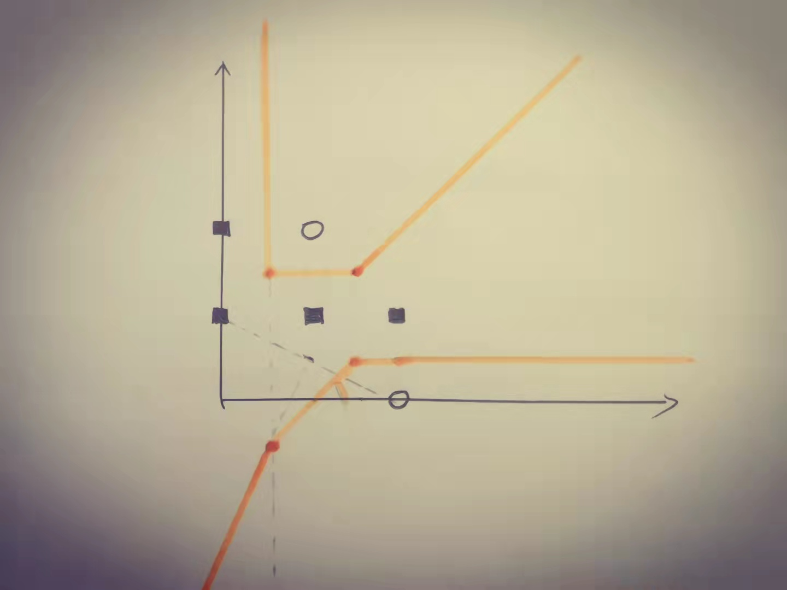

# hw1
#### id: 519021910861
#### name: huidong xu
------

### 1. Consider the following training set, in which each example has two tertiary attributes(0, 1, or 2) and one of two possible classes(X or Y).
| Example | $A_1$ | $A_2$ | Class |
| :--: | :--: | :--: | :--: |
| 1 | 0 | 1 | X |
| 2 | 2 | 1 | X |
| 3 | 1 | 1 | X |
| 4 | 0 | 2 | X |
| 5 | 1 | 2 | Y |
| 6 | 2 | 0 | Y |

#### 1) What feature would be chosen for the split at the root of a decision tree using the infromation gain criterion? Show the details. (Note: we split attributes at each value of the attributes, for example, $A_1 = 0$, $A_1 = 1$, $A_1 = 2$)
$$
Ent(D) = -\sum_{k = 1}^{|\gamma|}p_klog_2p_k = -\frac{1}{3}\times log_2\frac{1}{3} - \frac{2}{3}\times log_2\frac{2}{3} = log_2{3} - \frac{2}{3}
$$
$$
Gain(D, a) = Ent(D) - \sum_{v = 1}^{V}\frac{|D^v|}{|D|}Ent(D^v)
$$

$$
Gain(D, A_1) = (log_2{3} - \frac{2}{3}) - (\frac{1}{3} + \frac{1}{3}\times(\frac{1}{2}\times log_2\frac{1}{2} + \frac{1}{2}\times log_2\frac{1}{2}) + \frac{1}{3}\times(\frac{1}{2}\times log_2\frac{1}{2} + \frac{1}{2}\times log_2\frac{1}{2})) = log_2{3} - \frac{1}{3}
$$

$$
Gain(D, A_2) = (log_2{3} - \frac{2}{3}) - (\frac{1}{6} + \frac{2}{6}\times(\frac{1}{2}\times log_2\frac{1}{2} + \frac{1}{2}\times log_2\frac{1}{2}) + \frac{3}{6}) = log_2{3} - 1
$$

$$
Gain(D, A_2) \lt Gain(D, A_1)
$$

So choose $A_2$.

#### 2) What would th Naive Bayes algorithm predict for the class of the following new example? Show the details of the solution.
$$
P(Class | A_1, A_2) = \frac{P(Class)}{P(A_1, A_2)} \times P(A_1 | Class) \times P(A_2 | Class)
$$

$$
\begin{align}
P(Class = X) &= \frac{4}{6} = \frac{2}{3} \\
P(Class = Y) &= \frac{2}{6} = \frac{1}{3} \\
P(A_1 = 2, A_2 = 2) &= P(A_1 = 2)\times P(A_2 = 2) = \frac{1}{3} \times \frac{1}{3} = \frac{1}{9} \\
P(A_1 = 2 | Class = X) &= \frac{1}{4} \\
P(A_1 = 2 | Class = Y) &= \frac{1}{2} \\
P(A_2 = 2 | Class = X) &= \frac{1}{4} \\
P(A_2 = 2 | Class = Y) &= \frac{1}{2} \\
\end{align}
$$

$$
\begin{align}
P(Class = X | A_1 = 2, A_2 = 2) &= \frac{P(Class = X)}{P(A_1 = 2, A_2 = 2)} \times P(A_1 = 2 | Class = X) \times P(A_2 = 2 | Class = X) \\
&= \frac{\frac{2}{3}}{\frac{1}{9}} \times \frac{1}{4} \times \frac{1}{4} \\
&= \frac{3}{8}
\end{align}
$$

$$
\begin{align}
P(Class = Y | A_1 = 2, A_2 = 2) &= \frac{P(Class = Y)}{P(A_1 = 2, A_2 = 2)} \times P(A_1 = 2 | Class = Y) \times P(A_2 = 2 | Class = Y) \\
&= \frac{\frac{1}{3}}{\frac{1}{9}} \times \frac{1}{2} \times \frac{1}{2} \\
&= \frac{3}{4}
\end{align}
$$

$$
P(Class = Y | A_1 = 2, A_2 = 2) \gt P(Class = X | A_1 = 2, A_1 = 2)
$$

So Naive Bayes algorithm will predict _Y_ for it.

#### 3) Draw the decision boundaries for the nearest neighbor algorithm assuming that we are using standard Euclidean distance to compute the nearest neighbors.

#### 4) Which of these classifiers will be the least likely to classify the following data points correctly? Please explain the reason.
1. ID3
2. Naive Bayes
3. Logistic Regression
4. KNN

Logistic Regression. Because logistic regression is only for convex function, which is not suitable for the following data.

### 2. You have trained a logistic classifier $y = sigmoid(w_0 + w_1x_1 + w_2x_2)$. Suppose $w_0 = 6$, $w_1 = -1$, and $w_2 = 0$. Which of the following figures represents the decision boundary found by your classifier?
$$
y = sigmoid(w_0 + w_1x_1 + w_2x_2) = sigmoid(6 - x_1)
$$

So choose **A**.

### 3. Suppose we are given a dataset $D = \{(x^{(1)}, r^{(1)}), ..., (x^{(N)}, r^{(N)})\}$ and aim to learn some patterns using the following algorithms. Match the update rule for each algorithm.
A - 2
B - 3
C - 1