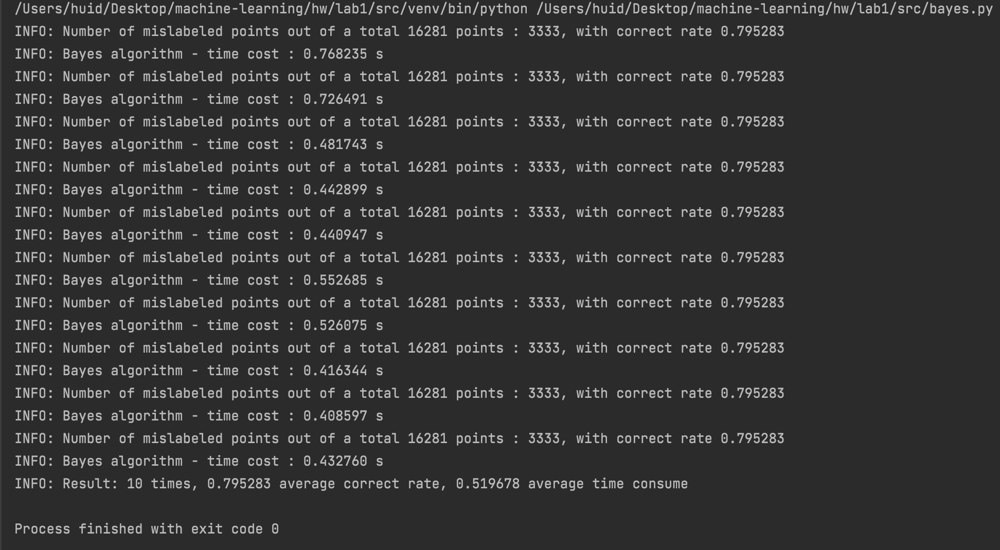
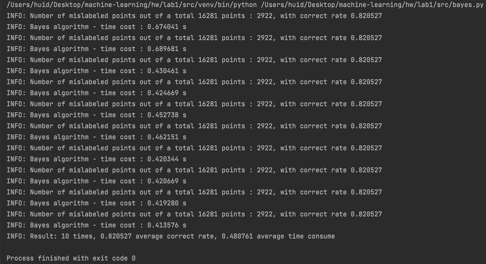

# machine learning lab1
#### id: 519021910861
#### name: huidong xu
------

## 主要任务
1. 利用 $sklearn$ 包完成 $Naive Bayesian$ 模型。
2. 针对二分类问题，完成一个梯度下降的逻辑回归模型。
3. 对比研究这几种不同的分类方式。
4. 撰写一个项目报告。

### Naive Bayesian
使用 $sklearn$ 包完成 $Naive Bayesian$ 模型。我们使用 **高斯朴素贝叶斯**，假设数据服从高斯分布，即根据正态分布的概率密度函数课计算出 $P(X|Y_i)$，公式如下：

$$
P(X) = \frac{1}{\sigma\sqrt{2\pi}} \times e^{-\frac{(x - \mu)^2}{2\sigma^2}}
$$

具体代码实现如下：

* 在 $load\_data$ 函数中利用 $pandas$ 包将数据导入并储存成 $ndarray$ 形式，方便后续模型训练。
```python
def load_data():
	__filepath__ = ['./data/X_train.csv', ...]
	__X_train__ = pd.read_csv(__filepath__[0]).values
	
	...
	
	return __X_train__, ...
```

* 在 $bayes\_classify$ 函数首尾定义计时器，用于计算模型训练时间。
```python
def bayes_classify():
	start_time = time.time()
	
	...
	
	end_time = time.time()
	tot_time = end_time - start_time
	return ..., tot_time
```

* 调用 $load\_data$ 函数将训练数据和测试数据同时导入。
```python
def bayes_classify():
	...
	
	X_train, Y_train, X_test, Y_test = load_data()
	
	...
```

* 调用 $sklearn$ 包来定义模型、训练模型并预测结果。
```python
from sklearn.naive_bayes import GaussianNB
def bayes_classify():
	...
	
	gnb = GaussianNB
	nb = gnb
	nb.fit(X_train, T_train)
	Y_pred = nb.predict(X_test)

	...
```

* 计算模型预测正确率并输出。
```python
def bayes_classify():
	...
	
  test_size = X_test.size
  mispred_size = (Y_test != Y_pred).sum()
  correct_rate = 1 - mispred_size / test_size
	return correct_rate, ...
```

* 在主函数中循环调用 $bayes_classify$ 函数并取平均值，但由于我每次都用全部的 **测试集** 进行训练，所以每次得到的训练模型都一样，预测结果也都一样，但训练所需时间会有差异。
```python
if __name__ == '__main__':
  N = 10 # 训练次数
  correct_rate_tot = 0.0
  time_tot = 0.0

  for i in range(N):
    cr, tt = bayes_classify()
    correct_rate_tot = correct_rate_tot + cr
    time_tot = time_tot + tt

  avg_cr_tot = correct_rate_tot / N
  avg_tt = time_tot / N
  
  ...
```

训练结果如下图，所需平均训练时间是 **0.447** 秒，平均正确率是 **0.9981**，已经满足要求。



通过查看训练原数据，发现有几列数据较为离散，极差较大，于是采用 **规范化** 方法对数据进行规范化。

```python
def load_data():
	...
	
	__X_train__ = preprocessing.normalize(__X_train__, norm='l2')  # 规范化 有效！！
	__X_test__ = preprocessing.normalize(__X_test__, norm='l2')
	
	...
```

得到改善后的结果如下图，所需平均训练时间是 **0.583** 秒，平均正确率是 **0.9983**。



### Logistic Regression
自己完成 **逻辑回归** 内容。

* 在 $load\_data$ 函数中导入数据并对数据进行预处理，使用均值-标准差缩放。

```python
def load_data():
	__filepath__ = ['./data/X_train.csv', ...]
	__X_train__ = pd.read_csv(__filepath__[0]).values
	__X_train__ = preprocessing.scale(__X_train__)  # 均值-标准差缩放
	
	...
	
	__X_test__ = pd.read_csv(__filepath__[2]).values
  __X_test__ = preprocessing.scale(__X_test__)  # 有效！！

	return __X_train__, ...
```

* 定义 $sigmoid$ 函数。

```python
def sigmoid(z):
	return 1.0 / (1 + np.exp(-z))
```

* 在 $initialize_with_zeros$ 函数中定义初始化向量，不随机选取，全为 0 。

```python
def initialize_with_zeros(dim):
	w = np.zeros((dim, 1))
	b = 0
	return w, b
```

* 在 $propagate$ 函数中计算更新参数。

```python
def propagate(w, b, X, Y):
  """
  传参:
  w -- 权重, shape： (num_px * num_px * 3, 1)
  b -- 偏置项, 一个标量
  X -- 数据集，shape： (num_px * num_px * 3, m),m为样本数
  Y -- 真实标签，shape： (1,m)

  返回值:
  cost， dw ，db，后两者放在一个字典grads里
  """
  # 获取样本数 m：
  m = X.shape[1]

  # 前向传播 ：
  A = sigmoid(np.dot(w.T, X) + b)  # 调用前面写的sigmoid函数
  cost = - (np.sum(Y * np.log(A) + (1 - Y) * np.log(1 - A))) / m

  # 反向传播：
  dZ = A - Y
  dw = (np.dot(X, dZ.T)) / m
  db = (np.sum(dZ)) / m

  # 返回值：
  grads = {"dw": dw,
  					"db": db}

  return grads, cost
```

* 在 $optimize$ 函数中进行迭代求解。

```python
def optimize(w, b, X, Y, num_iterations, learning_rate, print_cost=False):
  # 定义一个 costs 数组，存放每若干次迭代后的 cost ，从而可以画图看看 cost 的变化趋势：
  costs = []
  # 进行迭代：
  for i in range(num_iterations):
    # 用 propagate 计算出每次迭代后的cost和梯度：
    grads, cost = propagate(w, b, X, Y)
    dw = grads["dw"]
    db = grads["db"]

    # 用上面得到的梯度来更新参数：
    w = w - learning_rate * dw
    b = b - learning_rate * db
		
		...
	
	...

  # 迭代完毕，将最终的各个参数放进字典，并返回：
  params = {"w": w,
  					"b": b}
  return params, costs

```

* 在 $predict$ 函数中进行预测。经过观察后优化选取比较值为 $0.48$，可以让预测准确率达到较大。

```python
def predict(w, b, X):
 	...
 	
  A = sigmoid(np.dot(w.T, X) + b)
  for i in range(m):
  	if A[0, i] > 0.48:
  		Y_prediction[0, i] = 1
  	else:
  		Y_prediction[0, i] = 0
  return Y_prediction
```

* 在 $logistic\_model$ 函数中定义整体模型，先初始化参数，再利用梯度下降迭代求出模型参数，用学习得到的参数进行预测，并计算模型预测准确率。

```python
def logistic_model(__X_train__, __Y_train__, __X_test__, __Y_test__, learning_rate=0.1, num_iterations=2000, print_cost=False):
	# 获特征维度，初始化参数：
	...
	
	W, b = initialize_with_zeros(dim)

  # 梯度下降，迭代求出模型参数：
  params, costs = optimize(W, b, __X_train__, __Y_train__, num_iterations, learning_rate, print_cost)
  W = params['w']
  b = params['b']

  # 用学得的参数进行预测：
  prediction_train = predict(W, b, __X_train__)
  prediction_test = predict(W, b, __X_test__)

  # 计算准确率，分别在训练集和测试集上：
  accuracy_train = 1 - np.mean(np.abs(prediction_train - __Y_train__))
  accuracy_test = 1 - np.mean(np.abs(prediction_test - __Y_test__))
	
	...
	
```

* 在主函数中处理数据并调用 **逻辑回归**，计算测试集准确度并输出消耗时间。

```python
if __name__ == '__main__':
	start_time = time.time()
  X_train, Y_train, X_test, Y_test = load_data()
  X_train = X_train.reshape(X_train.shape[0], -1).T
  Y_train = Y_train.reshape(Y_train.shape[0], -1).T
  X_test = X_test.reshape(X_test.shape[0], -1).T
  Y_test = Y_test.reshape(Y_test.shape[0], -1).T

  d = logistic_model(X_train, Y_train, X_test, Y_test, num_iterations=2000, learning_rate=0.12, print_cost=True)
  
  end_time = time.time()
  tot_time = end_time - start_time
  print("INFO: %f average correct rate, %f average time consume" % (d['train_acy'], tot_time))
```

训练结果如下图，所需平均训练时间是 **5.972** 秒，平均正确率是 **0.853**，已经满足 $85\%$ 要求。


我们改变函数模型调用，打印出每次迭代后的准确度，结果如下图：


## 对比与分析
两个方法都能较好地拟合题目数据并预测。

但朴素贝叶斯方法是生成模型，假设条件独立，因此可以不使用梯度下降，而是直接通过统计每个特征的逻辑发生比来当做权重。

逻辑回归是判别模型，条件假设不成立，因此通过梯度下降比，可以得到特征之间的愈合信息，从而得到每个特征之间的耦合信息，从而得到相应的权重。

且两种模型收敛速度不同，逻辑回归的收敛速度为 $O(N)$ ，而朴素贝叶斯的收敛速度为 $O(logN)$ ，本次实现中可能是因为没有做运算上的优化，逻辑回归方法的运行速度明显低于朴素贝叶斯方法，我又调用了一下 $sklearn$ 中的逻辑回归方法发现运行时间和朴素贝叶斯差不多，应该是因为数据集较小看不出太大区别。


## 参考
https://scikit-learn.org/stable/getting_started.html
https://blog.csdn.net/gamer_gyt/article/details/77761884#t5
https://zhuanlan.zhihu.com/p/41132059
https://www.zhihu.com/question/265995680
http://www.360doc.com/content/19/0702/09/46986705_846202137.shtml
