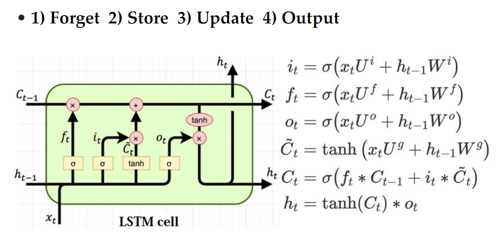
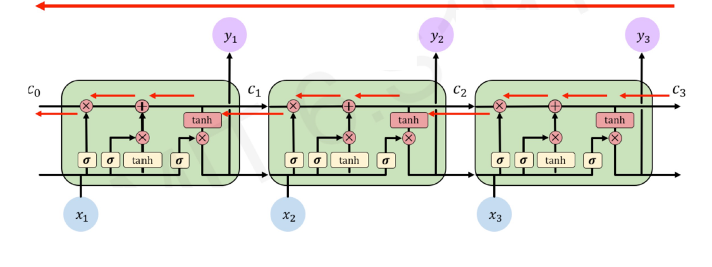
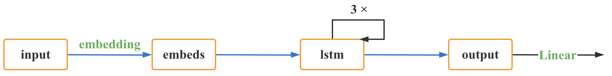
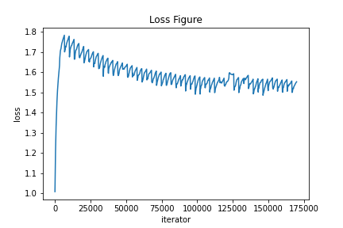
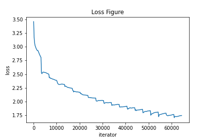
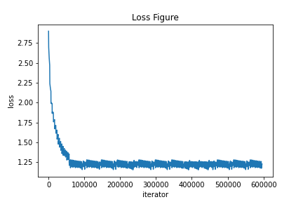
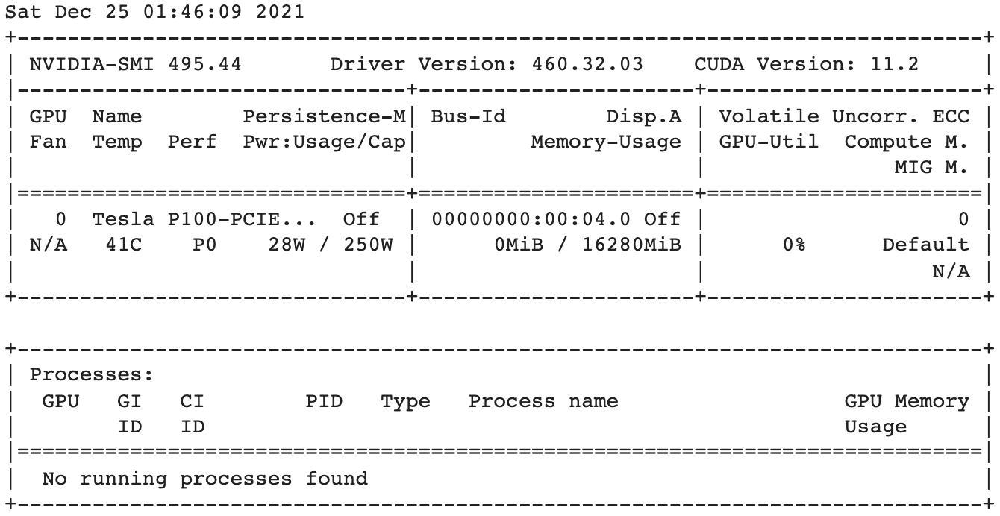

# AI-Poet

519021910861 徐惠东

519021910320 胡超

519021910174 陈子飏

------

**目录结构**

- AI-Poet.ipynb		          源代码，Jupiter Notebook 形式。
- AI-Poet.pptx		            项目 PPT。
- AI-Poet.pdf                       项目 PPT 的 PDF 版本。
- /imgs                                   项目文档所用图片。
- notes.md                            项目文档 Markdown 版本。
- notes.pdf                            项目文档 PDF 版本。
- tang_model_49.pth    预训练模型。

## 模型设计 ： LSTM

### 概述

LSTM的全称是Long Short Term Memory，它具有记忆长短期信息的能力的神经网络。LSTM提出的动机是为了解决传统的RNN的长期依赖问题。


而LSTM之所以能够解决RNN的长期依赖问题，是因为LSTM引入了门（gate）机制用于控制特征的流通和损失。LSTM是由一系列LSTM单元（LSTM Unit）组成，其链式结构如2-1。

<div  align="center">    

<small>图2-1</small>
</div>

### 定义
先定义LSTM单元中每个符号的含义。每个黄色方框表示一个神经网络层，由权值，偏置以及激活函数组成；每个粉色圆圈表示元素级别操作；箭头表示向量流向；相交的箭头表示向量的拼接；分叉的箭头表示向量的复制。总结如图2-2.

<div  align="center">    

<small>图2-2</small>
</div>

LSTM的核心部分是在图2-3中最上边类似于传送带的部分，这一部分一般叫做单元状态（cell state）它自始至终存在于LSTM的整个链式系统中。

其更新方法为：

$$C_{t}=f_{t} \times C_{t-1}+i_{t} \times \tilde{C}_{t}$$

<div align="center">    

<small>图2-3</small>
</div>

### 具体步骤
LSTM的工作原理分为四个主要步骤：
1. 遗忘
2. 存储
3. 更新
4. 输出

#### 1. 遗忘
如图2-4所示，$f_t$叫做遗忘门，表示 $C_{t-1}$的哪些特征被用于计算 $C_t$。 $f_t$是一个向量，向量的每个元素均位于 $[0,1]$ 范围内。通常我们使用 $sigmoid$ 作为激活函数， $sigmoid$的输出是一个介于 $[0,1]$区间内的值，但是在一个训练好的LSTM中，门的值绝大多数都非常接近0或者1，其余的值少之又少。其中 $\otimes$ 是LSTM最重要的门机制，表示 $f_t$ 和 $C_{t-1}$之间的单位乘的关系。

<div  align="center">    

<small>图2-4</small>
</div>

#### 2. 存储
如图2-5所示， $\tilde{C}_{t}$ 表示单元状态更新值，由输入数据 $x_t$ 和隐节点 $h_{t-1}$ 经由一个神经网络层得到，单元状态更新值的激活函数通常使用 $tanh$ 。 $i_t$ 叫做输入门，同 $f_t$ 一样也是一个元素介于 $[0,1]$ 区间内的向量，同样由 $x_t$ 和 $h_{t-1}$ 经由 $sigmoid$ 激活函数计算而成。

<div  align="center">    

<small>图2-5</small>
</div>


#### 3. 更新
$i_t$ 用于控制  $\tilde{C}_{t}$ 的哪些特征用于更新 $C_t$ ，使用方式和 $f_t$ 相同（图2-6）。


<div  align="center">    

<small>图2-6</small>
</div>

#### 4. 输出

最后，为了计算预测值 $\hat{y}_{t}$ 和生成下个时间片完整的输入，我们需要计算隐节点的输出 $h_t$ （图2-7）。


<div  align="center">    

<small>图2-7</small>
</div>


$h_t$ 由输出门 $o_t$ 和单元状态 $C_t$ 得到，其中 $o_t$ 的计算方式和 $f_t$ 以及 $i_t$ 相同。

总览如图2-8

<div  align="center">    

<small>图2-8</small>
</div>


### 前向传播算法

LSTM模型有两个隐藏状态$h^{(t)},C^{(t)}$ ，模型参数几乎是RNN的4倍，因为现在多了$W_f,U_f,b_f,W_a,U_a,b_a,W_i,U_i,b_i,W_o,U_o,b_o$这些参数。梯度流如图2-9所示。
<div  align="center">

<small>图2-9</small>
</div>

前向传播过程在每个序列索引位置的过程为：

1. 更新遗忘门输出：
$$f^{(t)}=\sigma\left(W_{f} h^{(t-1)}+U_{f} x^{(t)}+b_{f}\right)$$
2. 更新输入门两部分输出：
$$\begin{array}{c}
i^{(t)}=\sigma\left(W_{i} h^{(t-1)}+U_{i} x^{(t)}+b_{i}\right) \\
a^{(t)}=\tanh \left(W_{a} h^{(t-1)}+U_{a} x^{(t)}+b_{a}\right)
\end{array}$$

3. 更新细胞状态：

$$C^{(t)}=C^{(t-1)} \odot f^{(t)}+i^{(t)} \odot a^{(t)}$$

4. 更新输出门输出：

$$\begin{array}{c}
o^{(t)}=\sigma\left(W_{o} h^{(t-1)}+U_{o} x^{(t)}+b_{o}\right) \\
h^{(t)}=o^{(t)} \odot \tanh \left(C^{(t)}\right)
\end{array}$$

5. 更新当前序列索引预测输出：

$$\hat{y}^{(t)}=\sigma\left(V h^{(t)}+c\right)$$


### 反向传播算法


有了LSTM反向传播算法思路和RNN的反向传播算法思路一致，也是通过梯度下降法迭代更新所有的参数，关键点在于计算所有参数基于损失函数的偏导数。

在RNN中，为了反向传播误差，我们通过隐藏状态  $h^{(t)}$  的梯度  $\delta^{(t)}$  一步步向前传播。在LSTM这里也类似。只不过我们这里有两个隐藏状态 $h^{(t)}$  和 $ C^{(t)}$。  这里我们定义两个  $\delta$  ，即:
$$
\begin{aligned}
\delta_{h}^{(t)} &=\frac{\partial L}{\partial h^{(t)}} \\
\delta_{C}^{(t)} &=\frac{\partial L}{\partial C^{(t)}}
\end{aligned}
$$

为了便于推导，我们将损失函数  $L(t)$  分成两块，一块是时刻  $t$  位置的损失  $l(t)$  ，另一块是时刻  $t$  之后损失  $L(t+1)$  ，即:
$$
L(t)=\left\{\begin{array}{ll}
l(t)+L(t+1) & \text { if } t<\tau \\
l(t) & \text { if } t=\tau
\end{array}\right.
$$
而在最后的序列索引位置  $\tau$  的  $\delta_{h}^{(\tau)}$  和  $\delta_{C}^{(\tau)} $ 为:
$$
\begin{array}{c}
\delta_{h}^{(\tau)}=\left(\frac{\partial o^{(\tau)}}{\partial h^{(\tau)}}\right)^{T} \frac{\partial L^{(\tau)}}{\partial o^{(\tau)}}=V^{T}\left(\hat{y}^{(\tau)}-y^{(\tau)}\right) \\
\delta_{C}^{(\tau)}=\left(\frac{\partial h^{(\tau)}}{\partial C^{(\tau)}}\right)^{T} \frac{\partial L^{(\tau)}}{\partial h^{(\tau)}}=\delta_{h}^{(\tau)} \odot o^{(\tau)} \odot\left(1-\tanh ^{2}\left(C^{(\tau)}\right)\right)
\end{array}
$$
接着我们由  $\delta_{C}^{(t+1)}$, $\delta_{h}^{(t+1)}$  反向推导  $\delta_{h}^{(t)}, \delta_{C}^{(t)}$  。


$\delta_{h}^{(t)}$  的梯度由本层时刻的输出梯度误差和大于妒刻的误差两部分决定，即:
$$
\delta_{h}^{(t)}=\frac{\partial L}{\partial h^{(t)}}=\frac{\partial l(t)}{\partial h^{(t)}}+\left(\frac{\partial h^{(t+1)}}{\partial h^{(t)}}\right)^{T} \frac{\partial L(t+1)}{\partial h^{(t+1)}}\\
=V^{T}\left(\hat{y}^{(t)}-y^{(t)}\right)+\left(\frac{\partial h^{(t+1)}}{\partial h^{(t)}}\right)^{T} \delta_{h}^{(t+1)}
$$
整个LSTM反向传播的难点就在于  $\frac{\partial h^{(t+1)}}{\partial h^{(t)}} $  这部分的计算。仔细观察，由于  $h^{(t)}=o^{(t)} \odot \tanh \left(C^{(t)}\right)$在第一项 $ o^{(t)}$ 中，包含一个  $h$  的递推关系，第二项  $\tanh \left(C^{(t)}\right)$  就复杂了，  $\tanh$  函数里面又可以表示成:

$$C^{(t)}=C^{(t-1)} \odot f^{(t)}+i^{(t)} \odot a^{(t)}$$


$\tanh$  函数的第一项中，  $f^{(t)}$  包含一个  $h$  的递推关系，在  $\tanh$  函数的第二项中，  $i^{(t)}$  和  $a^{(t)}$  都包含  $h$  的递推关系，因此，最终  $\frac{\partial h^{(t+1)}}{\partial h(t)}$  这部分的计算结果由 四部分组成。即:

$$
\begin{array}{c}
\Delta C=o^{(t+1)} \odot\left[1-\tanh ^{2}\left(C^{(t+1}\right)\right] \\
\frac{\partial h^{(t+1)}}{\partial h^{(t)}}=\operatorname{diag}\left[o^{(t+1)} \odot\left(1-o^{(t+1)}\right) \odot \tanh \left(C^{(t+1)}\right)\right] W_{o}\\
+\operatorname{diag}\left[\Delta C \odot f^{(t+1)} \odot\left(1-f^{(t+1)}\right) \odot C^{(t)}\right] W_{f} \\
+\operatorname{diag}\left\{\Delta C \odot i^{(t+1)} \odot\left[1-\left(a^{(t+1)}\right)^{2}\right]\right\} W_{a}\\
+\operatorname{diag}\left[\Delta C \odot a^{(t+1)} \odot i^{(t+1)} \odot\left(1-i^{(t+1)}\right] W_{i}\right.
\end{array}
$$

而  $\delta_{C}^{(t)}$  的反向梯度误差由前一层  $\delta_{C}^{(t+1)}$  的梯度误差和本层的从  $h^{(t)}$ 传回来的梯度误差两部分组成，即:

$$
\begin{array}{c}
\delta_{C}^{(t)}=\left(\frac{\partial C^{(t+1)}}{\partial C^{(t)}}\right)^{T} \frac{\partial L}{\partial C^{(t+1)}}+\left(\frac{\partial h^{(t)}}{\partial C^{(t)}}\right)^{T} \frac{\partial L}{\partial h^{(t)}}\\
=\left(\frac{\partial C^{(t+1)}}{\partial C^{(t)}}\right)^{T} \delta_{C}^{(t+1)}+\delta_{h}^{(t)} \odot o^{(t)} \odot\left(1-\tanh ^{2}\left(C^{(t)}\right)\right)\\
=\delta_{C}^{(t+1)} \odot f^{(t+1)}+\delta_{h}^{(t)} \odot o^{(t)}\odot\left(1-\tanh ^{2}\left(C^{(t)}\right)\right)
\end{array}
$$

有了  $\delta_{h}^{(t)}$  和  $\delta_{C}^{(t)}$ ,就可以计算参数，以 $W_{f}$ 为例，其梯度计算过程为：

$$\frac{\partial L}{\partial W_{f}}=\sum_{t=1}^{\tau}\left[\delta_{C}^{(t)} \odot C^{(t-1)} \odot f^{(t)} \odot\left(1-f^{(t)}\right)\right]\left(h^{(t-1)}\right)^{T}$$


### 参考资料：

[课程文件-ch11-rnn.pdf]
[understanding-LSTMs](http://colah.github.io/posts/2015-08-Understanding-LSTMs/)
[详解LSTM](https://zhuanlan.zhihu.com/p/42717426)
[LSTM模型与前向反向传播算法](https://www.cnblogs.com/pinard/p/6519110.html)

## 训练方法

本AI作诗系统使用pyTorch库，并主要通过torch.nn.LSTM进行模型训练。

### 网络定义

```python
class PoetryModel(nn.Module):
    # 网络初始化，构造函数中vocab_size代表有多少个词，embedding_dim表示嵌入层向量维度，hidden_dim表示隐藏层向量维度，在config中定义
    def __init__(self, vocab_size, embedding_dim, hidden_dim):
        super(PoetryModel, self).__init__()
        self.hidden_dim = hidden_dim
        # 词向量层，词表大小 * 向量维度
        self.embeddings = nn.Embedding(vocab_size, embedding_dim)
        # 网络主要结构。num_layers为循环神经网络层数。
        self.lstm = nn.LSTM(embedding_dim, self.hidden_dim, num_layers=Config.num_layers)
        # 设置网络的全连接层
        self.linear = nn.Linear(self.hidden_dim, vocab_size)

    def forward(self, input, hidden=None):
        # 获取输入数据大小
        seq_len, batch_size = input.size()
        #print(input.shape)
        # 初始化nn.lstm的输入数据中的(h_0, c_0)
        if hidden is None:
            h_0 = input.data.new(Config.num_layers, batch_size, self.hidden_dim).fill_(0).float()
            c_0 = input.data.new(Config.num_layers, batch_size, self.hidden_dim).fill_(0).float()
        else:
            h_0, c_0 = hidden
        # 利用初始化完成的self.embeddings创建一个词嵌入模型
        # 输入 序列长度 * batch(每个汉字是一个数字下标)，
        # 输出 序列长度 * batch * 向量维度
        embeds = self.embeddings(input)
        # 利用初始化完成的self.lstm创建LSTM神经网络
        # 输入数据包括input,(h_0, c_0)
        # input:(seq_len,batch_size,input_size)
        # (h_0, c_0):(num_layers $*$ num_directions, batch, hidden_size)
        # 输出数据包括output，(h_n, c_n)(即hidden)
        # output:(seq_len, batch, num_directions $*$ hidden_size)
        # hidden的大小： 序列长度 * batch * hidden_dim
        output, hidden = self.lstm(embeds, (h_0, c_0))
        # output经过Linear判别，输出为output:(seq_len $*$ batch, vocab_size)
        output = self.linear(output.view(seq_len * batch_size, -1))
        return output, hidden
```

### 具体使用

```python
def train():
    if Config.use_gpu:
        Config.device = t.device("cuda")
    else:
        Config.device = t.device("cpu")
    device = Config.device
    # 获取数据，data为预先给好的numpy数组，共57580首*125字
    datas = np.load("tang.npz")
    data = datas['data']
    # word2ix和ix2word都是字典类型，用于字符和序号的映射
    ix2word = datas['ix2word'].item()
    word2ix = datas['word2ix'].item()
    data = t.from_numpy(data)
    # batch_size为一次内训练的诗歌数量
    dataloader = DataLoader(data,
                            batch_size=Config.batch_size,
                            shuffle=True,
                            num_workers=2)

    # 定义模型
    model = PoetryModel(len(word2ix),
                        embedding_dim=Config.embedding_dim,
                        hidden_dim = Config.hidden_dim)
    # 利用torch.optim.Adam构建优化器对象Configimizer，动态调整每个参数的学习率
    Configimizer = optim.Adam(model.parameters(),lr=Config.lr)
    # 构建criterion用于计算损失
    criterion = nn.CrossEntropyLoss()
    if Config.model_path:
        model.load_state_dict(t.load(Config.model_path,map_location='cpu'))
    # 转移到相应计算设备上
    model.to(device)
    # 通过torch.meter.AverageValueMeter()计算均值和标准差
    loss_meter = meter.AverageValueMeter()
    # 进行训练
    f = open('result.txt','w')
    # epoch表示迭代次数
    for epoch in range(Config.epoch):
        # 每次迭代前将loss_meter重置
        loss_meter.reset()
        for li,data_ in tqdm.tqdm(enumerate(dataloader)):
            #print(data_.shape)
            # 将数据转置并且复制了一份，成了(seq_len,batch_size）
            data_ = data_.long().transpose(1,0).contiguous()
            # 注意这里，也转移到了计算设备上
            data_ = data_.to(device)
            Configimizer.zero_grad()
            # n个句子，前n-1句作为输入，后n-1句作为输出，二者一一对应
            input_,target = data_[:-1,:],data_[1:,:]
            # 正式将输入经过网络并得到output
            output,_ = model(input_)
            #print("Here",output.shape)
            # 通过target.view(-1)将target变成((seq_len-1) $*$ batch)
            print(target.shape,target.view(-1).shape)
            # 计算损失
            loss = criterion(output,target.view(-1))
            # 反向传播
            loss.backward()
            # 对所有参数进行更新
            Configimizer.step()
            loss_meter.add(loss.item())
            # 进行可视化
            if (1+li)%Config.plot_every == 0:
                # 在控制台输出本次迭代的训练损失
                print("训练损失为%s"%(str(loss_meter.mean)))
                # 将训练损失记录在result.txt中
                f.write("训练损失为%s"%(str(loss_meter.mean)))
        t.save(model.state_dict(),'%s_%s.pth'%(Config.model_prefix,epoch))

```

## 训练过程

### 模型接口
主要关注 LSTM 层数，epoch 和 batch_size 参数。

**LSTM 层数**
在大规模翻译任务的经验中，简单的堆叠 LSTM 层最多可以工作 4 层，很少工作 6 层，超过8层就很差了。本模型选择使用 3 层。

**epoch**
向前和向后传播中所有批次的单次训练迭代，即训练过程中全部样本数据将被“轮”多少次。

**batch_size**
基本上现在的梯度下降都是基于 mini-batch 的，每次训练使用 batch_size 个数据进行参数寻优，一批中的数据共同决定了本次梯度的方向。


```python
class Config(object):
    num_layers = 3  # LSTM层数
		...
    lr = 1e-3
    weight_decay = 1e-4
    use_gpu = True
    epoch = 30
    batch_size = 25
    maxlen = 125  # 超过这个长度的之后字被丢弃，小于这个长度的在前面补空格
    plot_every = 200  # 每20个batch 可视化一次
    max_gen_len = 200  # 生成诗歌最长长度
    ...
    embedding_dim = 256
    hidden_dim = 512
    ...
```

### 数据集

使用整理好的 **numpy** 格式的[开源数据集](http://pytorch-1252820389.cosbj.myqcloud.com/tang_199.pth)，其中包含唐诗共 57580 首 * 125 字，不足和超出 125 字的都已经被补全或者截断。

```Python
# 处理数据
datas = np.load("/content/drive/MyDrive/AI-Poet/tang.npz", allow_pickle=True)
data = datas['data']
ix2word = datas['ix2word'].item()
word2ix = datas['word2ix'].item()
data = t.from_numpy(data)
dataloader = DataLoader(data,
                        batch_size=Config.batch_size,
                        shuffle=True,
                        num_workers=2)
```

**细节解释**
1. data 是 numpy 数组，共 57580 首 * 125 字。
2. word2ix 和 ix2word 都是字典类型，用于字符和序号的映射。

### LSTM 循环神经网络

LSTM 是一种特殊的 RNN，能够解决长序列训练过程中的梯度消失和梯度爆炸问题，相比于 RNN 只有一个传递状态 $h^t$，LSTM 有两个传输状态分别是 $c^t$ (cell state) 和 $h^t$ (hidden state)。

其中对于传递下去的 $c^t$ 改变得较慢，通常输出的 $c^t$ 是上一个状态传过来的 $c^{t - 1}$ 加上一些数值，而 $h^t$ 则在不同节点下有较大区别。本模型便采用了 LSTM 模型进行训练。

```Python
class PoetryModel(nn.Module):
    def __init__(self, vocab_size, embedding_dim, hidden_dim):
        super(PoetryModel, self).__init__()
        self.hidden_dim = hidden_dim
        # 词向量层，词表大小 * 向量维度
        self.embeddings = nn.Embedding(vocab_size, embedding_dim)
        # 网络主要结构
        self.lstm = nn.LSTM(embedding_dim, self.hidden_dim, num_layers=Config.num_layers)
        # 进行分类
        self.linear = nn.Linear(self.hidden_dim, vocab_size)

    def forward(self, input, hidden=None):
        seq_len, batch_size = input.size()
        # print(input.shape)
        if hidden is None:
            h_0 = input.data.new(Config.num_layers, batch_size, self.hidden_dim).fill_(0).float()
            c_0 = input.data.new(Config.num_layers, batch_size, self.hidden_dim).fill_(0).float()
        else:
            h_0, c_0 = hidden
        # 输入 序列长度 * batch(每个汉字是一个数字下标)，
        # 输出 序列长度 * batch * 向量维度
        embeds = self.embeddings(input)
        # 输出hidden的大小： 序列长度 * batch * hidden_dim
        output, hidden = self.lstm(embeds, (h_0, c_0))
        output = self.linear(output.view(seq_len * batch_size, -1))
        return output, hidden
```

**细节解释**



将数据集作为喂给模型的作为 _input_，先经过 _embedding_ 预处理得到 _embeds_ 层，然后经过 _LSTM_ 进行训练得到 _hidden_ 层和 _output_ 层，最后经过 _Linear_ 层判别，然后反向传播并循环训练即可。

### 训练方法

使用 GPU 进行训练，每次将数据输入进 LSTM 网络进行前向传播训练，然后使用误差反向传播进行修正，每隔一定数据量进行一次可视化，不断迭代更新。

```python
loss_data = []
# 进行训练并画图
def train():
  f = open(Config.result_path, 'w')
  for epoch in range(basic_start, Config.epoch):
      loss_meter.reset()
      for li, data_ in tqdm.tqdm(enumerate(dataloader)):
          # 将数据转置并复制一份
          data_ = data_.long().transpose(1, 0).contiguous()
          # 注意这里，也转移到了计算设备上
          data_ = data_.to(device)
          Configimizer.zero_grad()
          # n个句子，前n-1句作为inout，后n-1句作为label，二者一一对应
          # 经过 LSTM 网络进行前向传播
          input_, target = data_[:-1, :], data_[1:, :]
          output, _ = model(input_)
          # 误差反向传播
          loss = criterion(output, target.view(-1))
          loss.backward()
          Configimizer.step()
          loss_meter.add(loss.item())
          # 存储 loss 数据，方便之后画图
          loss_data.append(loss)
          # 进行可视化
          if (1 + li) % Config.plot_every == 0:
              print("训练损失为%s\n" % (str(loss_meter.mean)))
              ...
train()
```

### 诗句生成

#### 首句生成模式

优先使用风格前缀生成隐藏层，并结合用户输入的首句喂给预训练模型生成下一句，再使用生成的下一句作为下一次迭代的输入，不断迭代直至达到最大生成字数或遇到终止符 \<EOP\> 为止。

```python
# 给定首句生成诗歌
def generate(model, start_words, ix2word, word2ix, prefix_words=None):
		...   
    # 若有风格前缀，则先用风格前缀生成hidden
    if prefix_words:
        for word in prefix_words:
            output, hidden = model(input, hidden)
            input = input.data.new([word2ix[word]]).view(1, 1)

    # 开始真正生成诗句，如果没有使用风格前缀，则hidden = None，input = <START>
    # 否则，input就是风格前缀的最后一个词语，hidden也是生成出来的
    for i in range(Config.max_gen_len):
        output, hidden = model(input, hidden)
        if i < start_words_len:
            ...
            input = input.data.new([word2ix[w]]).view(1, 1)
        else:
            ...
            input = input.data.new([top_index]).view(1, 1)
        if w == '<EOP>':
            del results[-1]
            break
    return results
```

#### 藏头诗模式

优先使用风格前缀生成隐藏层，并结合用户输入每次喂给模型一个字作为开头并续写，迭代更新至用户输入用完为止。

```python
# 生成藏头诗
def gen_acrostic(model, start_words, ix2word, word2ix, prefix_words=None):
    input = (t.Tensor([word2ix['<START>']]).view(1, 1).long())
		...
    # 存在风格前缀，则生成hidden
    if prefix_words:
        for word in prefix_words:
            output, hidden = model(input, hidden)
            input = (input.data.new([word2ix[word]])).view(1, 1)

    # 开始生成诗句
    for i in range(Config.max_gen_len):
        output, hidden = model(input, hidden)
        top_index = output.data[0].topk(1)[1][0].item()
        w = ix2word[top_index]
        # 说明上个字是句末
        if pre_word in {'。', '，', '?', '！', '<START>'}:
            ...
        else:
            input = (input.data.new([top_index])).view(1, 1)
        result.append(w)
        pre_word = w
    return result
print("Define usage successfully\n")
```

## 调参结果及实验

假如使用引用出处的预训练模型训练，由于其本身模型训练的太好，loss 值就很小，所以在我重新训练时 loss 值会先上升，而后 loss 值不断下降，在 1.5 左右达到收敛。



随后我没有使用其训练好的预训练模型进行训练，而是从头训练。在某次训练时，超参数 _epoch_ 较小，而 _batch_size_ 较大，造成了模型的欠拟合，从 loss-iteration 图可以看出，在模型后半阶段仍旧有下降空间，因此该训练模型欠拟合，诗歌效果不好。



不断调试超参数，直到各参数设置成[这样](./imgs/metedata.txt)，可以看出模型在大约 100000 次迭代后 loss 趋于稳定，有较小范围内波动属于正常现象，但基本稳定在 1.15 ~ 1.25 之间，可以认为模型训练已经收敛。经检验，该模型效果较好。



## 诗句展示

1. 首句生成

> 草色青青柳色黄，紫梨花谢春风开。
> 江水东流无社稷，君王朝日如冬霜。
> 白头老少今何幸，每见知君心不伤。

"草色青青柳色黄" 摘选自唐代诗人_贾至_的《春思》，原诗通过描写春草、柳树、桃花、李花等景色，借用东风、春日表达作者心中的愁绪和苦闷之情。

本模型则借助梨花、春风等景色，表达出古代君王一事无成悲叹万分的心境，最后一句更是感慨年华易逝，劝解年轻人珍惜青葱岁月。虽然与原诗不尽相同，但无论从意蕴、韵脚等方面都颇具形态。

------

> 寂寞梧桐深院锁清秋，灯火暗悠悠。
> 宛转芳兰满，芊绵坠露生。
> 露禽啼不寐，惊鸟不闻声。
> 悄悄星河晓，团团月殿横。

"寂寞梧桐深院锁清秋" 摘选自五代诗人_李煜_的《相见欢》，原诗站在一个孤独的人独自一人登上西楼，周围是一片清冷凄凉的秋色，烘托出诗人的离异思念爱国交织的情感。

本模型则渲染出昏暗的灯光下，有鸟禽深夜不眠啼叫，星河和月亮在惨淡的夜空上默默地交相浑映，营造出一种寂寥、清冷的孤寂氛围，也侧面体现出了作者思家思国思社稷的孤独心境。

------

> 明月几时有，秋风人未归。
> 青春来取道，春日向前飞。
> 洛阳桃李红，泪尽湘水流。
> 一杯须更醉，一日无所求。
> 朝朝海上起，细发斗中愁。
> 乡思日浩渺，妾思烟水流。
> 离怀一水色，何处不堪愁。
> 一醉不可识，日暮水东流。

"明月几时有" 摘选自宋代诗人_苏轼_脍炙人口的《水调歌头》，原诗勾勒出一种皓月当空、亲人千里、孤高旷远的境界氛围，反衬自己遗世独立的意绪和往昔的神话传说融合一处，表达了对胞弟苏澈的无限怀念。

本模型则在开头便点出"人未归"，营造出离别之痛，在整诗对于细节的描写更是令人称奇。例如"细发斗中愁" 将这份惆怅寄托在细发之上，愁之大与发之细形成鲜明反差，直击人心。而尾句更是写出了自己日日酒醉，消沉度日，将诗人无限的愁肠尽情释放出来。

------

2. 藏头诗模式

> 爱君古贤者，饮造古太平。
> 国有圣贤子，水有帝王城。
> 荣名贵相府，思国势不平。
> 校奉两仪血，源厉万姓名。

这首诗歌以交大校训 "饮水思源，爱国荣校" 为藏头部分，通过描写古代圣贤开明的君主治理社会井井有条，以及百姓思念这样贤明的君王，是对校训中 "感恩" 精神的完美诠释。

------

> 我有一人承晓镜，
> 喜君发我与君恩。
> 欢娱未得知君意，
> 你竟无言亦不还。

这首诗以 "我喜欢你" 藏头，适用于给单身青年表白专用，尤其适用于交大这般的工科院校。细细评味之后，发现描写的是破镜重圆，感激涕零的甜美爱情故事，可以用来给心爱的女孩子表白，也是本模型实用性强的一种体现。

------

3. 风格

**不使用风格**

> 红藕香残玉簟秋，鸳鸯一卷掩玲旌。
> 一声清晓起秋月，万籁千声惹九秋。

在给出首句且不使用风格的情况下，全诗通过描写鸳鸯、清晓秋月等景物，动静结合，渲染出一个完整的秋天模样。

------

**使用首句风格**

> 红藕香残玉簟秋，水精帘暖魂相续。
> 江南昔日不得游，落日孤舟漾楚波。

"红藕香残玉簟秋" 摘选自宋代女词人_李清照_的《一剪梅》，表达出词人与丈夫赵明诚离别后独上兰舟以排遣愁怀。

本模型则描绘出词人秋游江南不得，孤身在孤舟上赏着落日残辉，荡漾起楚楚波浪的孤寂情境。

------

**使用风格 "春风得意马蹄疾，一日看尽长安花"**

> 红藕香残玉簟秋，一旦春风携去来。
> 长歌宛转怨不见，一曲一曲歌声来。

风格语句摘选自唐代诗人_孟郊_的《登科后》，描绘了诗人金榜题名人生得意时的欢愉之情，是较为欢快明朗的风格。

本模型也同样以春风、长歌和歌声等物象，通过视听结合的手法，充分体现出诗歌第三句所言"怨不见"，从而烘托出与风格语句相类似的欢乐氛围。

------

**使用风格 "八百里分麾下炙，五十弦翻塞外声"**

> 红藕香残玉簟秋，风吹雨洒江楼席。
> 忆昔湖畔选旅人，今年战士归江上。

风格语句摘选自南宋词人_辛弃疾_的《破阵子·为陈同甫赋壮词以寄之》，通过创造雄奇的意境，生动地描绘出一位披肝沥胆、忠一不二、勇往直前的将军形象，同时也表达了杀敌报国、收复失地的理想。

本模型通过描写了在湖畔边追忆旅人，今年征战沙场的将士将从江上归来，抒发了雄心壮志的英雄气概，与原风格非常契合。

------

## 运行说明

```python
...
def userTest():
    print("正在初始化......")
    datas = np.load('/'.join([Config.data_path, Config.pickle_path]), allow_pickle=True)
    data = datas['data']
    ix2word = datas['ix2word'].item()
    word2ix = datas['word2ix'].item()
    model = PoetryModel(len(ix2word), Config.embedding_dim, Config.hidden_dim)
    model.load_state_dict(t.load(Config.model_path, 'cpu'))
    if Config.use_gpu:
        model.to(t.device('cuda'))
    print("初始化完成！\n")
    while True:
        print("欢迎使用唐诗生成器，\n"
              "输入1 进入首句生成模式\n"
              "输入2 进入藏头诗生成模式\n")
        mode = int(input())
        if mode == 1:
            print("请输入您想要的诗歌首句，可以是五言或七言")
            start_words = str(input())
            gen_poetry = ''.join(generate(model, start_words, ix2word, word2ix))
            print("生成的诗句如下：%s\n" % (gen_poetry))
            f.write("首句生成模式: %s\n %s\n" % (start_words, gen_poetry))
        elif mode == 2:
            print("请输入您想要的诗歌藏头部分，不超过16个字，最好是偶数")
            start_words = str(input())
            gen_poetry = ''.join(gen_acrostic(model, start_words, ix2word, word2ix))
            print("生成的诗句如下：%s\n" % (gen_poetry))
            f.write("藏头诗模式: %s\n %s\n" % (start_words, gen_poetry))
userTest()
```

**使用方法**

使用 Colab 打开项目，在 _AI-Poet.ipynb_ 中 _User Test_ 部分点击运行，根据提示输入 **1（首句生成）**或者 **2（藏头诗）**来选择生成诗句模式。
若是**首句生成**模式，则需再输入诗歌首句。若是**藏头诗**模式，则需输入诗歌藏头部分。

## 总结

### 总结这个学期

本学期的机器学习课程，老师们在课上深入浅出，将理论与实践结合地介绍了众多机器学习模型。过度平缓，从简单的线性模型、贝叶斯模型到后面的深度学习模型，一方面结合了上学期的《计算机中的数学基础》课程所学内容，又在此基础上从更多角度拓展了理论，介绍了很多在实践中应用广泛的模型。让我们在机器学习方面学到了很多。其中 LSTM 模型是基于 RNN 模型的改良，LSTM 的改良过程，很好地体现了机器学习发展过程中模型的改进过程。模型遇到困难，需要先理论分析问题产生的原因，然后再从理论上解决，有改良细节的调整参数和函数选择，也有改良本质结构的模型更新。

我们很高兴能够在这次作业中，实际动手将LSTM用于制作诗词生成器。

### 遇到的困难

最初试图使用 _MacBook Pro 2017_ 进行训练，然而因为是 _Intel_ 显卡没办法直接使用 _cuda_，所以只能使用 cpu 导致训练速度极慢。经过粗略计算，跑完一遍模型需要约 15 天时间，因此不在本机跑模型。

之后尝试过阿里云租借服务器、百度飞桨平台等，但都觉得过于复杂。最终选用谷歌的 Colab 平台进行训练，所分配到的 GPU 为 _Tesla P100_，训练一次模型时间约为 3 小时。



### 收获
合理使用网络资源，用云计算资源提高作业效率。

### 致谢

感谢 **顾小东老师** 和 **丁玥老师** 的精彩讲解和悉心指导，**柴迤天助教** 和 **施宇翔助教** 也给我们提供了许多帮助，感谢团结合作的小组成员，最终让该项目能够顺利完成。