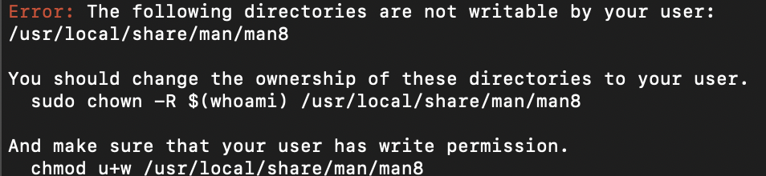
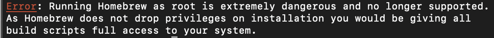

# scikit learn

## install

[Reference](https://scikit-learn.org/stable/install.html#install-official-release)

### install python3
install python3 using homebrew 
```bash
brew install python
```


using `sudo` to get permission
```bash
sudo brew install python
```


goto [python website](https://www.python.org/downloads/release/python-3100/) to get install package [macOS 64-bit universal2 installer] for macOS

create linking from python3 to python
```bash
ls -l /usr/local/bin/python*
ln -s -f /usr/local/bin/python3 /usr/local/bin/python
```

reopen terminal
```bash
python --version
```

### install pip
using vscode terminal and python to automatically install pip [reference](https://pip.pypa.io/en/stable/installation/)
```bash
python -m ensurepip --upgrade
```

### install the latest scikit-learn release
```bash
pip install -U scikit-learn
```
check my installation : scikit-learn 0.20.4 installed
```bash
python -m pip show scikit-learn  # to see which version and where scikit-learn is installed
python -m pip freeze  # to see all packages installed in the active virtualenv
python -c "import sklearn; sklearn.show_versions()"
```

### install dependencies
查看安装包版本
```bash
python -c "import scipy; print(scipy.version.version)"
```

```bash
pip3 install numpy # 1.14.6 at least, 1.21.2 installed 
pip3 install scipy # 1.1.0 at least, 1.2.3 installed
pip3 install joblib # 0.11 at least, 1.1.0 installed
pip3 install threadpoolctl # 2.0.0 at least, 3.0.0 installed
pip3 install cython # 0.28.5 at least, 0.29.24 installed
pip3 install matplotlib # 2.2.2 at least, 2.2.5 installed
pip3 install scikit-image # 0.14.5 at least, 0.14.5 installed
pip3 install pandas # 0.25.0 at least, 
pip3 install seaborn # 0.9.0 at least, 0.9.1 installed
pip3 install memory_profiler # 0.57.0 at least, 0.57.0 installed
pip3 install pytest # 5.0.1 at least, 6.2.5 installed
pip3 install putest-cov # 2.9.0 at least, 2.12.1 installed
pip3 install flake8 # 3.8.2 at least, 3.9.2 installed
pip3 install black # 21.6b0 at least, 21.9b0 installed
pip3 install mypy # 0.770 at least, 0.910 installed
pip3 install pyamg # 4.0.0 at least,
pip3 install sphinx # 4.0.1 at least, 4.2.0 installed
pip3 install sphinx-gallery # 0.7.0 at least, 0.10.0 installed
pip3 install numpydoc # 1.0.0 at least, 1.1.0 installed
pip3 install Pillow # 7.1.2 at least, 8.3.2 installed
pip3 install sphinx-prompt # 1.3.0 at least, 1.4.0 installed
pip3 install sphinx-opengraph # 0.4.2 at least, 0.4.2 installed
```

### third party distributions of scikit-learn
my mac is using Intel core
```bash
conda install -c intel scikit-learn
```

## follow guidance

[Reference](https://scikit-learn.org/stable/getting_started.html)

### Fitting and predicting: estimator basics
estimators: built-in machine learning algorithms and models. ex. RandomForestClassifier
```python
clf = RandomForestClassifier(random_state=0)
X = [[ 1,  2,  3],  # 2 samples, 3 features
     [11, 12, 13]]
y = [0, 1]  # classes of each sample
clf.fit(X, y)
```

### Transformers and pre-processors
transforms or imputes the data
```python
X = [[0, 15], [1, -10]]
print(StandardScaler().fit(X).transform(X))
```

### Pipelines: chaining pre-processors and estimators
transformers and estimators combined together -> Pipeline
```python
# create a pipeline object
pipe = make_pipeline(
    StandardScaler(),
    LogisticRegression()
)

# load the iris dataset and split it into train and test sets
X, y = load_iris(return_X_y=True)
X_train, X_test, y_train, y_test = train_test_split(X, y, random_state=0)

# fit the whole pipeline
pipe.fit(X_train, y_train)


# we can now use it like any other estimator
accuracy_score(pipe.predict(X_test), y_test)
```

### Model evaluation
cross_validator: perform a 5-fold cross-validation procedure
```python
X, y = make_regression(n_samples=1000, random_state=0)
lr = LinearRegression()

result = cross_validate(lr, X, y)  # defaults to 5-fold CV
result['test_score']  # r_squared score is high because dataset is easy
```

### Automatic parameter searches
the best parameter combinations via cross-validation
```python
X, y = fetch_california_housing(return_X_y=True)
X_train, X_test, y_train, y_test = train_test_split(X, y, random_state=0)

# define the parameter space that will be searched over
param_distributions = {'n_estimators': randint(1, 5),
                       'max_depth': randint(5, 10)}

# now create a searchCV object and fit it to the data
search = RandomizedSearchCV(estimator=RandomForestRegressor(random_state=0),
                            n_iter=5,
                            param_distributions=param_distributions,
                            random_state=0)
search.fit(X_train, y_train)

search.best_params_

# the search object now acts like a normal random forest estimator
# with max_depth=9 and n_estimators=4
search.score(X_test, y_test)
```

## follow user guide

[Reference](https://scikit-learn.org/stable/user_guide.html#user-guide)


